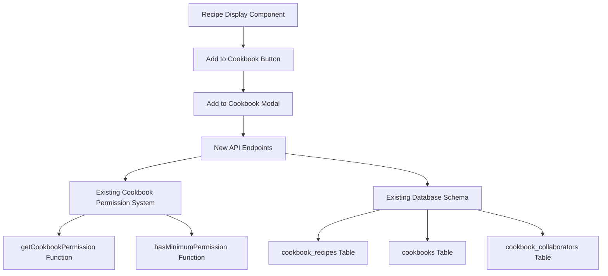

# Design Document

## Overview

The "Add to Cookbook" feature extends the existing Jump to Recipe application by providing a streamlined interface for adding recipes to cookbooks directly from recipe pages. The design leverages the existing cookbook infrastructure, permission system, and database schema while introducing new API endpoints and UI components for efficient recipe-to-cookbook management.

## Architecture

### System Integration



### Component Architecture

The feature integrates with existing components and introduces new ones:

- **Existing**: `RecipeDisplay` component, cookbook permission utilities, database schema
- **New**: `AddToCookbookButton` component, `AddToCookbookModal` component, recipe-cookbook API endpoints
- **Modified**: `RecipeDisplay` component to include the new button

## Components and Interfaces

### UI Components

#### 1. AddToCookbookButton Component
```typescript
interface AddToCookbookButtonProps {
  recipeId: string;
  className?: string;
}
```

**Responsibilities:**
- Renders the "Add to Cookbook" button
- Handles modal open/close state
- Positioned next to "View Original Recipe" button

#### 2. AddToCookbookModal Component
```typescript
interface AddToCookbookModalProps {
  recipeId: string;
  isOpen: boolean;
  onClose: () => void;
}

interface CookbookOption {
  id: string;
  name: string;
  isChecked: boolean;
  isOwned: boolean;
  lastUsed?: Date;
}
```

**Responsibilities:**
- Fetches user's editable cookbooks
- Displays searchable cookbook list with checkboxes
- Handles optimistic UI updates
- Manages API calls for add/remove operations
- Shows "Create Cookbook" option when no cookbooks available

#### 3. Modified RecipeDisplay Component
**Changes:**
- Add `AddToCookbookButton` next to existing "View Original Recipe" button
- Center both buttons under the recipe image
- Maintain existing layout and styling patterns

### API Endpoints

#### 1. Get Recipe's Cookbook Status
```typescript
GET /api/recipes/[id]/cookbooks?editableOnly=true

Response: {
  cookbooks: Array<{
    id: string;
    name: string;
    isChecked: boolean;
    isOwned: boolean;
    permission: 'edit' | 'owner';
    lastUsed?: Date;
  }>;
}
```

**Purpose:** Fetch all cookbooks the user can edit and their current status for the recipe

#### 2. Add Recipe to Cookbook
```typescript
POST /api/cookbooks/[id]/recipes

Body: {
  recipeId: string;
}

Response: {
  success: true;
  message: string;
}
```

**Purpose:** Add a single recipe to a specific cookbook

#### 3. Remove Recipe from Cookbook
```typescript
DELETE /api/cookbooks/[id]/recipes/[recipeId]

Response: {
  success: true;
  message: string;
}
```

**Purpose:** Remove a single recipe from a specific cookbook

### Database Integration

The feature uses the existing database schema without modifications:

```sql
-- Existing table structure (no changes needed)
CREATE TABLE cookbook_recipes (
  id UUID PRIMARY KEY DEFAULT gen_random_uuid(),
  cookbook_id UUID REFERENCES cookbooks(id) ON DELETE CASCADE,
  recipe_id UUID REFERENCES recipes(id) ON DELETE CASCADE,
  position INTEGER NOT NULL,
  added_at TIMESTAMP DEFAULT NOW(),
  created_at TIMESTAMP DEFAULT NOW(),
  updated_at TIMESTAMP DEFAULT NOW(),
  UNIQUE(cookbook_id, recipe_id)
);
```

**Key Design Decisions:**
- Reuse existing `cookbook_recipes` table
- Maintain position-based ordering (append to end)
- Leverage existing CASCADE constraints for cleanup
- Use existing uniqueness constraint for duplicate prevention

## Data Models

### TypeScript Interfaces

```typescript
// New interfaces for the feature
interface RecipeCookbookStatus {
  cookbooks: CookbookOption[];
  totalCount: number;
}

interface CookbookOption {
  id: string;
  name: string;
  isChecked: boolean;
  isOwned: boolean;
  permission: 'edit' | 'owner';
  lastUsed?: Date;
}

interface AddRecipeRequest {
  recipeId: string;
}

interface RemoveRecipeResponse {
  success: boolean;
  message: string;
}

// Extended existing interfaces
interface Recipe {
  // ... existing properties
  cookbookStatus?: RecipeCookbookStatus; // Optional for caching
}
```

### API Response Formats

```typescript
// Success responses
interface SuccessResponse {
  success: true;
  message: string;
  data?: any;
}

// Error responses
interface ErrorResponse {
  success: false;
  error: string;
  message: string;
  statusCode: number;
}
```

## Error Handling

### Client-Side Error Handling

1. **Optimistic UI Updates**
   - Immediately update checkbox state
   - Revert on API failure with toast notification
   - Handle concurrent operations gracefully

2. **Network Errors**
   - Retry mechanism for transient failures
   - Clear error messaging for permanent failures
   - Graceful degradation when API unavailable

3. **Permission Errors**
   - Handle 403 Forbidden responses
   - Refresh cookbook list if permissions changed
   - Clear messaging about insufficient permissions

### Server-Side Error Handling

1. **Validation Errors**
   - Recipe ID validation (UUID format, exists)
   - Cookbook ID validation (UUID format, exists, permissions)
   - Request body validation using Zod schemas

2. **Database Errors**
   - Duplicate entry handling (409 Conflict)
   - Foreign key constraint violations
   - Transaction rollback on failures

3. **Permission Errors**
   - Integration with existing permission system
   - Consistent error responses across endpoints
   - Audit logging for permission violations

## Testing Strategy

### Unit Testing

1. **Component Testing**
   - `AddToCookbookButton` render and click behavior
   - `AddToCookbookModal` state management and UI interactions
   - Search functionality and filtering logic
   - Optimistic UI update and rollback scenarios

2. **API Testing**
   - All new endpoint functionality
   - Permission checking integration
   - Error response handling
   - Database constraint validation

3. **Utility Testing**
   - Cookbook sorting and filtering logic
   - Permission integration functions
   - Data transformation utilities

### Integration Testing

1. **End-to-End Workflows**
   - Complete add-to-cookbook flow from recipe page
   - Permission-based cookbook visibility
   - Error handling and recovery scenarios
   - Cross-browser compatibility

2. **Database Integration**
   - Recipe-cookbook relationship management
   - Cascade deletion behavior
   - Uniqueness constraint enforcement
   - Position management for new entries

### Performance Testing

1. **Load Testing**
   - Modal opening with large cookbook lists
   - Concurrent add/remove operations
   - Search performance with many cookbooks

2. **Optimization**
   - Cookbook list caching strategies
   - Debounced search input
   - Efficient database queries

## Security Considerations

### Authentication & Authorization

1. **Session Validation**
   - All API endpoints require valid authentication
   - Integration with existing NextAuth.js setup
   - Session timeout handling

2. **Permission Enforcement**
   - Reuse existing `getCookbookPermission` function
   - Server-side permission validation for all operations
   - No client-side permission bypassing

3. **Input Validation**
   - UUID validation for all IDs
   - SQL injection prevention via Drizzle ORM
   - XSS prevention in cookbook names and search

### Data Protection

1. **Privacy Controls**
   - Only show cookbooks user has edit access to
   - Respect existing cookbook visibility settings
   - No data leakage through error messages

2. **Rate Limiting**
   - Prevent rapid-fire add/remove operations
   - API endpoint rate limiting
   - Client-side debouncing for search

## Performance Optimization

### Frontend Performance

1. **Lazy Loading**
   - Modal component loaded only when needed
   - Cookbook list fetched on modal open
   - Efficient re-rendering with React keys

2. **Caching Strategy**
   - Cache cookbook list during session
   - Invalidate cache on cookbook changes
   - Optimistic updates for immediate feedback

3. **Search Optimization**
   - Client-side filtering for responsiveness
   - Debounced search input (300ms)
   - Efficient string matching algorithms

### Backend Performance

1. **Database Optimization**
   - Efficient queries using existing indexes
   - Batch operations where possible
   - Connection pooling for concurrent requests

2. **API Response Optimization**
   - Minimal data transfer in responses
   - Compressed responses for large cookbook lists
   - Efficient JSON serialization

## Accessibility Considerations

1. **Keyboard Navigation**
   - Modal accessible via keyboard
   - Tab order through cookbook checkboxes
   - Escape key to close modal

2. **Screen Reader Support**
   - Proper ARIA labels for all interactive elements
   - Checkbox state announcements
   - Modal focus management

3. **Visual Accessibility**
   - High contrast for checkbox states
   - Clear visual feedback for actions
   - Consistent with existing design system

## Mobile Responsiveness

1. **Modal Design**
   - Full-screen modal on mobile devices
   - Touch-friendly checkbox targets
   - Optimized search input for mobile keyboards

2. **Button Placement**
   - Responsive button layout under recipe image
   - Appropriate spacing for touch targets
   - Consistent with existing mobile patterns

## Future Considerations

1. **Bulk Operations**
   - Select multiple cookbooks simultaneously
   - Bulk add/remove operations
   - Enhanced UI for power users

2. **Advanced Features**
   - Cookbook suggestions based on recipe content
   - Recently used cookbook prioritization
   - Keyboard shortcuts for power users

3. **Analytics Integration**
   - Track cookbook usage patterns
   - Popular recipe-cookbook combinations
   - User engagement metrics