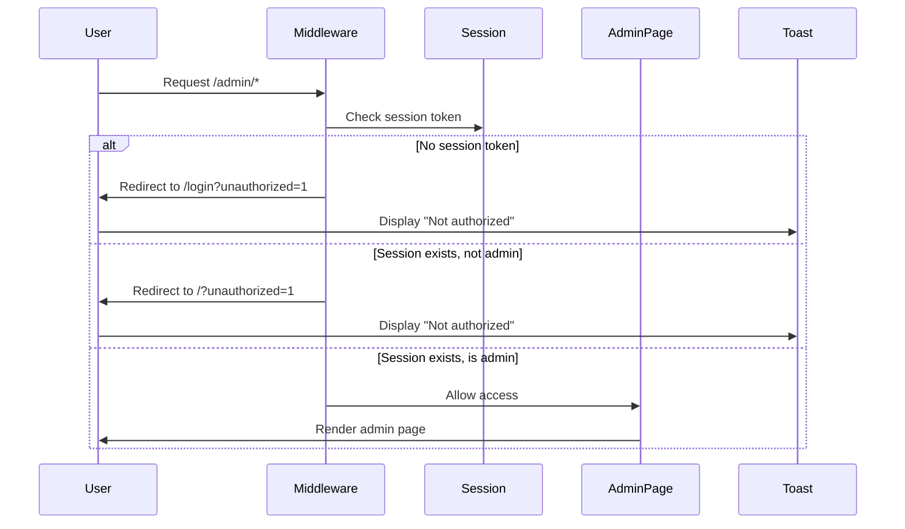

# Design Document

## Overview

This design implements a comprehensive admin access control system for the Jump to Recipe application. The solution uses a layered security approach combining server-side middleware for route protection with client-side feedback mechanisms for user experience. The design leverages the existing NextAuth.js authentication system and extends it with role-based authorization checks.

## Architecture

### Security Layers

The admin access control system implements defense-in-depth with three security layers:

1. **Server Middleware Layer**: Intercepts requests to `/admin/*` routes before any page rendering occurs
2. **Session Token Layer**: Validates user authentication and role from JWT tokens
3. **Client Feedback Layer**: Provides user-friendly error messages and handles unauthorized access attempts

### Authentication Flow



## Components and Interfaces

### 1. Middleware Enhancement

**File**: `src/middleware.ts`

The existing middleware will be extended to handle admin route protection:

```typescript
// Pseudo-code structure
export async function middleware(request: NextRequest) {
  const pathname = request.nextUrl.pathname;
  
  // Existing public route checks...
  
  // NEW: Admin route protection
  if (pathname.startsWith('/admin')) {
    const sessionToken = getSessionToken(request);
    
    if (!sessionToken) {
      return redirectToLogin(pathname);
    }
    
    const session = await decodeSessionToken(sessionToken);
    
    if (session?.user?.role !== 'admin') {
      return redirectToHome();
    }
  }
  
  // Existing protected route checks...
  
  return NextResponse.next();
}
```

**Key Design Decisions**:
- Use existing session token extraction logic
- Decode JWT to access role information (requires NextAuth secret)
- Append `unauthorized=1` query parameter for client-side toast triggering
- Maintain existing middleware patterns for consistency

### 2. Authorization Helper Enhancement

**File**: `src/lib/auth.ts`

The existing `hasRole` function will be used for authorization checks. Additional helper functions will be added:

```typescript
// Existing hasRole function is already implemented

// NEW: Admin-specific helper
export const isAdmin = (userRole: string | undefined): boolean => {
  return userRole === 'admin';
};

// NEW: Server-side session helper for admin pages
export const requireAdmin = async (session: Session | null) => {
  if (!session?.user) {
    throw new Error('Unauthorized: No session');
  }
  
  if (!isAdmin(session.user.role)) {
    throw new Error('Unauthorized: Admin role required');
  }
  
  return session;
};
```

### 3. User Profile Dropdown Enhancement

**File**: `src/components/user-profile-button.tsx`

The existing profile dropdown will be extended to include an admin link:

```typescript
// Inside the dropdown menu, after existing links:
{session?.user?.role === 'admin' && (
  <Link
    href="/admin"
    className="flex items-center px-4 py-2 text-sm hover:bg-muted focus:bg-muted focus:outline-none"
    onClick={() => setIsMenuOpen(false)}
    role="menuitem"
  >
    <Shield className="mr-2 h-4 w-4" />
    Admin
  </Link>
)}
```

**Design Decisions**:
- Use conditional rendering based on role
- Place admin link between "My Recipes" and "Settings" for logical grouping
- Use Shield icon from lucide-react for visual consistency
- Maintain existing accessibility patterns (role="menuitem")

### 4. Admin Layout Component

**File**: `src/app/admin/layout.tsx`

A new layout component will handle unauthorized access feedback:

```typescript
'use client';

export default function AdminLayout({ children }: { children: React.ReactNode }) {
  const searchParams = useSearchParams();
  const router = useRouter();
  const { toast } = useToast();
  
  useEffect(() => {
    if (searchParams.get('unauthorized') === '1') {
      toast({
        title: 'Not authorized',
        description: 'You do not have permission to access that page.',
        variant: 'destructive',
      });
      
      // Remove query parameter
      router.replace(window.location.pathname);
    }
  }, [searchParams, router, toast]);
  
  return <>{children}</>;
}
```

**Design Decisions**:
- Use client component for access to useSearchParams and useToast
- Trigger toast only when unauthorized parameter is present
- Clean up URL by removing query parameter after toast is shown
- Use destructive variant for error visibility
- Wrap children without additional layout structure (uses root layout)

### 5. Admin Page Components

**Directory Structure**:
```
src/app/admin/
├── layout.tsx          # Handles unauthorized toast
├── page.tsx            # Admin dashboard
├── users/
│   └── page.tsx        # User management placeholder
├── recipes/
│   └── page.tsx        # Recipe management placeholder
└── cookbooks/
    └── page.tsx        # Cookbook management placeholder
```

**Page Component Pattern**:
```typescript
// Example: src/app/admin/page.tsx
import { getServerSession } from 'next-auth';
import { authOptions } from '@/lib/auth';
import { redirect } from 'next/navigation';

export default async function AdminDashboard() {
  const session = await getServerSession(authOptions);
  
  // Double-check authorization (defense in depth)
  if (!session?.user || session.user.role !== 'admin') {
    redirect('/?unauthorized=1');
  }
  
  return (
    <div className="container mx-auto py-8">
      <h1 className="text-3xl font-bold mb-6">Admin Dashboard</h1>
      <p className="text-muted-foreground">Welcome to Admin Dashboard</p>
    </div>
  );
}
```

**Design Decisions**:
- Use server components for initial render performance
- Include server-side authorization check as secondary defense
- Use consistent container and typography patterns from existing pages
- Keep placeholder content minimal but professional

## Data Models

### Session Extension

The existing NextAuth session type is already extended with role information:

```typescript
// Already implemented in src/types/next-auth.d.ts
declare module 'next-auth' {
  interface Session {
    user: {
      id: string;
      name?: string | null;
      email?: string | null;
      image?: string | null;
      role: string;
    }
  }
  
  interface User {
    role: string;
  }
}
```

### User Role Values

The `users.role` field supports three values:
- `user` (default): Standard user access
- `elevated`: Enhanced permissions (future use)
- `admin`: Full administrative access

## Error Handling

### Unauthorized Access Scenarios

| Scenario | Middleware Action | Client Action |
|----------|------------------|---------------|
| No session + /admin/* | Redirect to `/login?unauthorized=1` | Show toast on login page |
| Session exists, role !== admin + /admin/* | Redirect to `/?unauthorized=1` | Show toast on home page |
| Direct page access (middleware bypass) | Server component redirects | Show toast on redirect target |

### Toast Notification Specification

```typescript
{
  title: 'Not authorized',
  description: 'You do not have permission to access that page.',
  variant: 'destructive',
}
```

### Error Recovery

- Users are redirected to safe pages (login or home)
- Toast provides clear feedback about the issue
- No error states are persisted in URL after toast is shown
- Users can retry access after obtaining admin role

## Testing Strategy

### Manual Testing Checklist

1. **Unauthenticated Access**
   - Navigate to `/admin` without login
   - Verify redirect to `/login?unauthorized=1`
   - Verify toast appears on login page
   - Verify URL is cleaned after toast

2. **Non-Admin Authenticated Access**
   - Login as regular user
   - Navigate to `/admin`
   - Verify redirect to `/?unauthorized=1`
   - Verify toast appears on home page
   - Verify URL is cleaned after toast

3. **Admin Access**
   - Login as admin user
   - Navigate to `/admin`
   - Verify page loads successfully
   - Verify no toast appears
   - Test all admin sub-routes

4. **Navigation Integration**
   - Login as regular user
   - Open profile dropdown
   - Verify admin link is NOT visible
   - Logout and login as admin
   - Open profile dropdown
   - Verify admin link IS visible
   - Click admin link and verify navigation

5. **Direct URL Access**
   - Test direct navigation to `/admin/users`
   - Test direct navigation to `/admin/recipes`
   - Test direct navigation to `/admin/cookbooks`
   - Verify all routes are protected

### Database Testing

1. **Role Assignment**
   ```sql
   -- Test setting admin role
   UPDATE users SET role = 'admin' WHERE email = 'test@example.com';
   
   -- Verify role was set
   SELECT id, email, role FROM users WHERE email = 'test@example.com';
   ```

2. **Role Validation**
   - Verify only valid role values are accepted
   - Test that role changes take effect on next login
   - Verify JWT token includes updated role

### Edge Cases

- Session expiration during admin page access
- Role change while user is on admin page
- Multiple tabs with different sessions
- Browser back button after unauthorized redirect
- Bookmark to admin page with expired session

## Security Considerations

### Defense in Depth

1. **Middleware Protection**: First line of defense, prevents unauthorized page loads
2. **Server Component Checks**: Secondary validation in page components
3. **API Route Protection**: Admin API routes must implement separate authorization
4. **JWT Token Security**: Role information stored in signed JWT token

### Attack Vectors and Mitigations

| Attack Vector | Mitigation |
|--------------|------------|
| JWT token manipulation | Token is signed with NextAuth secret |
| Direct API access | API routes must implement separate auth checks |
| Client-side role spoofing | Role is validated server-side from JWT |
| Session hijacking | Use secure cookies (httpOnly, secure, sameSite) |
| Privilege escalation | Role changes require database update |

### Future Security Enhancements

- Add audit logging for admin access attempts
- Implement rate limiting on admin routes
- Add two-factor authentication for admin accounts
- Create admin activity monitoring dashboard
- Implement session timeout for admin users

## Performance Considerations

### Middleware Performance

- JWT decoding adds minimal overhead (~1-2ms)
- Middleware runs on edge network (Vercel Edge Functions)
- No database queries in middleware (uses JWT claims)
- Caching not required due to fast execution

### Client-Side Performance

- Toast component is already loaded in root layout
- No additional bundle size for admin link (conditional render)
- Admin pages use server components for optimal performance
- Placeholder pages have minimal rendering cost

## Accessibility

### Keyboard Navigation

- Admin link in dropdown is keyboard accessible
- Follows existing dropdown navigation patterns
- Toast notifications are announced to screen readers

### Screen Reader Support

- Admin link has proper role="menuitem" attribute
- Toast uses aria-live region for announcements
- Error messages are descriptive and actionable

### Visual Accessibility

- Toast uses destructive variant for clear error indication
- Admin link uses Shield icon for visual distinction
- Maintains existing color contrast ratios

## Migration and Deployment

### Database Migration

No database migration required. The `role` field already exists in the users table with default value 'user'.

### Initial Admin Setup

1. Deploy application with admin access control
2. Manually set admin role for initial administrator:
   ```sql
   UPDATE users SET role = 'admin' WHERE email = 'admin@example.com';
   ```
3. Admin user logs out and logs back in to refresh JWT token
4. Admin user can now access admin pages

### Rollback Plan

If issues arise:
1. Remove admin route protection from middleware
2. Hide admin link in profile dropdown
3. Admin pages remain but are not accessible
4. No database changes needed for rollback

## Future Enhancements

### Phase 2: Admin User Management

- UI for viewing all users
- UI for changing user roles
- User search and filtering
- Bulk role operations

### Phase 3: Admin Content Management

- Recipe moderation interface
- Cookbook approval workflow
- Content reporting and review
- Bulk content operations

### Phase 4: Admin Analytics

- User activity dashboard
- Content statistics
- System health monitoring
- Performance metrics

## Documentation Requirements

### Developer Documentation

- Update README with admin access setup instructions
- Document role hierarchy and permissions
- Provide SQL commands for role management
- Document middleware configuration

### User Documentation

- Admin user guide (future)
- Role and permission matrix
- Admin feature documentation
- Security best practices

## Dependencies

### Existing Dependencies

- next-auth: ^4.x (authentication and session management)
- next: ^15.4.1 (middleware and routing)
- lucide-react: (Shield icon for admin link)

### No New Dependencies Required

All functionality can be implemented using existing dependencies and patterns.
