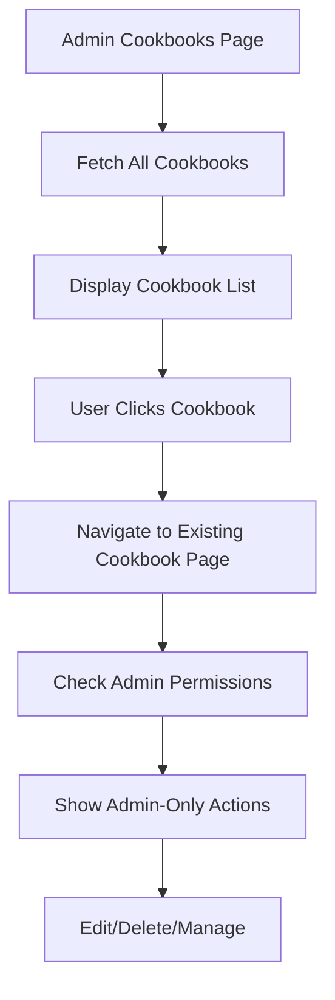

# Design Document

## Overview

The admin cookbook management feature provides administrators with comprehensive control over all cookbooks in the platform. The design leverages existing cookbook components and follows established admin UI patterns to minimize development effort while ensuring consistency. The system extends the current cookbook permission model to grant admins universal access while maintaining data integrity and user experience.

## Architecture

### Component Architecture

The feature follows the established admin pattern with three main layers:

1. **Server Components** - Handle data fetching and authorization
2. **Client Components** - Manage interactive functionality and state
3. **Shared Components** - Reuse existing cookbook UI components

### Permission Model Extension

The existing cookbook permission system will be extended to recognize admin privileges:

```typescript
// Extended permission checking
function hasAdminOrOwnerAccess(user: User, cookbook: Cookbook): boolean {
  return user.role === 'admin' || cookbook.ownerId === user.id;
}
```

### Data Flow



## Components and Interfaces

### 1. Admin Cookbook List Page (`/admin/cookbooks`)

**Component Structure:**
```
AdminCookbooksPage (Server Component)
├── AdminBreadcrumb
├── Page Header
└── CookbookListClient (Client Component)
    ├── Search/Filter Controls
    ├── Data Table
    └── Pagination
```

**Data Interface:**
```typescript
interface CookbookWithMetadata {
  id: string;
  title: string;
  owner: {
    id: string;
    name: string;
    email: string;
  };
  collaboratorCount: number;
  recipeCount: number;
  createdAt: Date;
  isPublic: boolean;
}
```

### 2. Enhanced Cookbook Edit Page

**Admin-Only Components:**
- `AdminCollaboratorManager` - Manage cookbook collaborators
- `AdminOwnershipTransfer` - Reassign cookbook ownership

**Component Integration:**
```typescript
// Existing cookbook edit page with admin enhancements
function CookbookEditPage({ cookbook, isAdmin }: Props) {
  return (
    <div>
      <CookbookForm cookbook={cookbook} />
      {isAdmin && (
        <>
          <AdminCollaboratorManager cookbook={cookbook} />
          <AdminOwnershipTransfer cookbook={cookbook} />
        </>
      )}
    </div>
  );
}
```

### 3. Admin Collaborator Manager

**Interface:**
```typescript
interface AdminCollaboratorManagerProps {
  cookbook: Cookbook;
  onUpdate?: () => void;
}

interface CollaboratorAction {
  type: 'add' | 'remove' | 'update';
  userId: string;
  permission?: 'view' | 'edit';
}
```

### 4. Admin Ownership Transfer

**Interface:**
```typescript
interface AdminOwnershipTransferProps {
  cookbook: Cookbook;
  onTransfer?: (newOwnerId: string) => void;
}

interface UserSearchResult {
  id: string;
  name: string;
  email: string;
}
```

## Data Models

### Database Schema Extensions

No new tables required. The feature leverages existing schema:

```sql
-- Existing tables used:
-- cookbooks (main cookbook data)
-- cookbook_collaborators (collaborator relationships)
-- users (user information)
```

### API Endpoints

**New Admin Endpoints:**
```typescript
// GET /api/admin/cookbooks - List all cookbooks with metadata
// PUT /api/admin/cookbooks/[id]/owner - Transfer ownership
// POST /api/admin/cookbooks/[id]/collaborators - Add collaborator
// DELETE /api/admin/cookbooks/[id]/collaborators/[userId] - Remove collaborator
```

**Enhanced Existing Endpoints:**
```typescript
// Existing cookbook endpoints with admin permission bypass
// GET /api/cookbooks/[id] - Admin can access any cookbook
// PUT /api/cookbooks/[id] - Admin can edit any cookbook
// DELETE /api/cookbooks/[id] - Admin can delete any cookbook
```

## Error Handling

### Permission Validation

```typescript
// Server-side permission checking
async function validateAdminAccess(session: Session): Promise<boolean> {
  if (!session?.user || session.user.role !== 'admin') {
    throw new UnauthorizedError('Admin access required');
  }
  return true;
}
```

### Error Boundaries

- **Client-side**: React Error Boundaries for component failures
- **Server-side**: Try-catch blocks with user-friendly error messages
- **API**: Consistent error response format

### Graceful Degradation

- Loading states for all async operations
- Fallback UI for failed data fetches
- Optimistic updates with rollback on failure

## Testing Strategy

### Unit Tests

**Components to Test:**
- `CookbookListClient` - Search, filter, sort functionality
- `AdminCollaboratorManager` - Add/remove collaborator actions
- `AdminOwnershipTransfer` - User search and selection
- Permission utility functions

**Test Cases:**
```typescript
describe('AdminCollaboratorManager', () => {
  it('should display current collaborators');
  it('should add new collaborator');
  it('should remove existing collaborator');
  it('should handle API errors gracefully');
});
```

### Integration Tests

**API Endpoint Tests:**
- Admin cookbook list with proper data aggregation
- Ownership transfer with database updates
- Collaborator management with permission updates
- Permission bypass for admin users

### End-to-End Tests

**User Flows:**
1. Admin navigates to cookbook list
2. Admin searches and filters cookbooks
3. Admin edits cookbook metadata
4. Admin manages collaborators
5. Admin transfers ownership
6. Admin deletes cookbook

## Performance Considerations

### Data Fetching Optimization

```typescript
// Optimized query with joins and aggregations
const cookbooksWithMetadata = await db
  .select({
    id: cookbooks.id,
    title: cookbooks.title,
    owner: users.name,
    collaboratorCount: sql<number>`count(distinct ${cookbookCollaborators.userId})`,
    recipeCount: sql<number>`count(distinct ${cookbookRecipes.recipeId})`,
    createdAt: cookbooks.createdAt,
  })
  .from(cookbooks)
  .leftJoin(users, eq(cookbooks.ownerId, users.id))
  .leftJoin(cookbookCollaborators, eq(cookbooks.id, cookbookCollaborators.cookbookId))
  .leftJoin(cookbookRecipes, eq(cookbooks.id, cookbookRecipes.cookbookId))
  .groupBy(cookbooks.id, users.name);
```

### Caching Strategy

- **Server-side**: Next.js unstable_cache for cookbook list
- **Client-side**: React Query for user search results
- **Cache invalidation**: On cookbook updates, ownership changes

### Pagination

- Server-side pagination for large cookbook lists
- Configurable page size (default: 20 items)
- URL-based pagination state for bookmarking

## Security Considerations

### Authorization

- **Defense in depth**: Multiple permission checks
- **Session validation**: Server-side session verification
- **Role verification**: Admin role required for all operations

### Data Validation

```typescript
// Input validation schemas
const ownershipTransferSchema = z.object({
  newOwnerId: z.string().uuid(),
  cookbookId: z.string().uuid(),
});

const collaboratorSchema = z.object({
  userId: z.string().uuid(),
  permission: z.enum(['view', 'edit']),
});
```

### Audit Trail

- Log all admin actions for accountability
- Track ownership changes and collaborator modifications
- Maintain operation timestamps and admin user IDs

## Implementation Notes

### Reusability

- Maximum reuse of existing cookbook components
- Consistent admin UI patterns across features
- Shared permission utilities and validation logic

### Accessibility

- Keyboard navigation for all interactive elements
- Screen reader support with proper ARIA labels
- High contrast mode compatibility
- Focus management for modal dialogs

### Responsive Design

- Mobile-friendly table layouts with horizontal scrolling
- Collapsible filters on smaller screens
- Touch-friendly button sizes and spacing