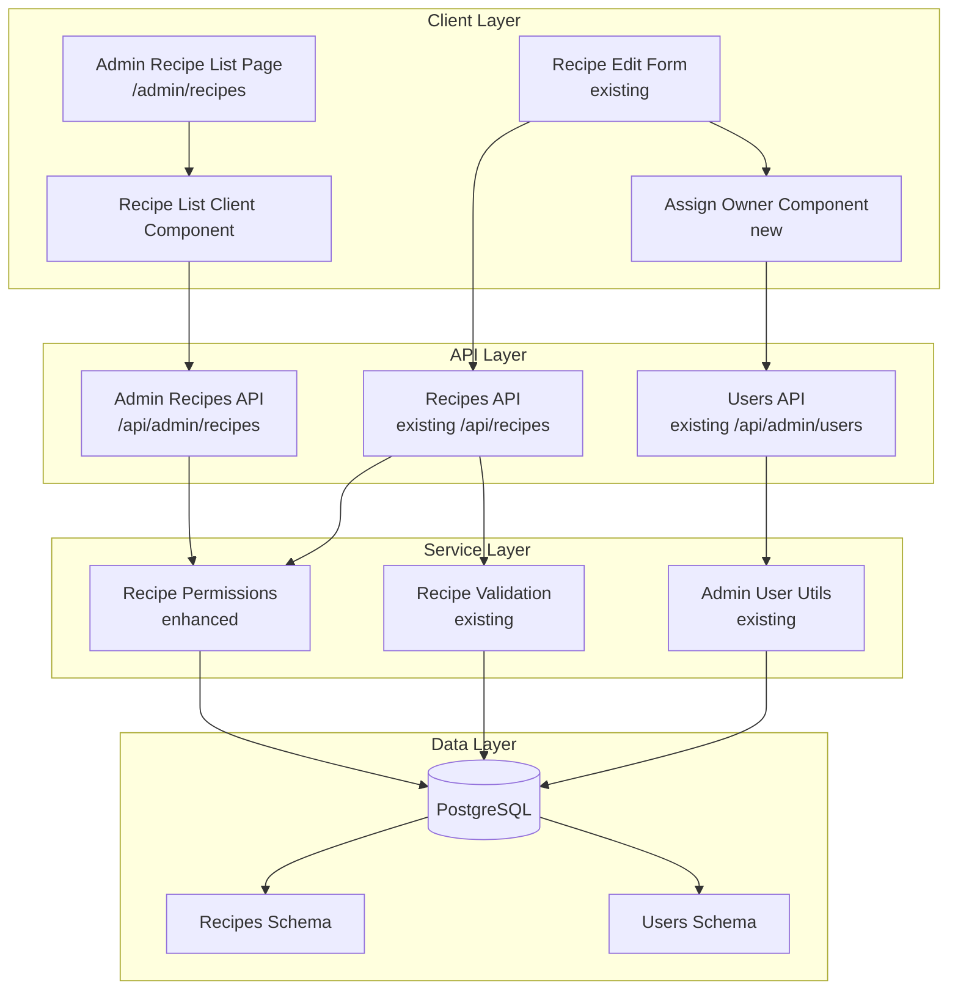

# Design Document

## Overview

The Admin Recipe Management feature extends the existing Jump to Recipe platform to provide administrators with comprehensive oversight and control over all recipes in the system. This design leverages existing components and patterns established in the user management system while introducing recipe-specific functionality. The architecture prioritizes code reuse, maintains consistency with existing admin interfaces, and ensures secure authorization at every layer.

The feature consists of three primary components:
1. **Admin Recipe List Page** - A server-rendered page with client-side filtering and sorting
2. **Recipe Ownership Transfer** - An admin-only component integrated into the existing recipe edit flow
3. **Enhanced Permission System** - Extended authorization logic to support admin-level recipe operations

## Architecture

### High-Level Architecture



### Component Hierarchy

```
/admin/recipes (Server Component)
├── RecipeListClient (Client Component)
│   ├── Search Input
│   ├── Filter Controls
│   │   ├── Owner Filter (Select)
│   │   └── Visibility Filter (Select)
│   ├── Sort Controls (Table Headers)
│   └── Recipe Table
│       └── Recipe Rows (clickable)
│
/recipes/[id]/edit (Existing Client Component)
├── RecipeForm (Existing)
└── AssignOwnerSection (New - Admin Only)
    ├── User Search Dropdown
    └── Current Owner Display
```

## Components and Interfaces

### 1. Admin Recipe List Page

**File:** `src/app/admin/recipes/page.tsx`

**Type:** Server Component

**Responsibilities:**
- Verify admin authentication and authorization
- Fetch all recipes with author information from database
- Aggregate recipe metadata (author name, dates, visibility)
- Pass data to client component for rendering

**Data Structure:**
```typescript
interface RecipeWithAuthor {
  id: string;
  title: string;
  authorId: string;
  authorName: string;
  authorEmail: string;
  visibility: 'public' | 'private';
  createdAt: Date;
  updatedAt: Date;
  viewCount: number;
  tags: string[];
}
```

**Database Query Pattern:**
```typescript
const recipesWithAuthors = await db
  .select({
    id: recipes.id,
    title: recipes.title,
    authorId: recipes.authorId,
    authorName: users.name,
    authorEmail: users.email,
    visibility: recipes.visibility,
    createdAt: recipes.createdAt,
    updatedAt: recipes.updatedAt,
    viewCount: recipes.viewCount,
    tags: recipes.tags,
  })
  .from(recipes)
  .leftJoin(users, eq(recipes.authorId, users.id))
  .orderBy(desc(recipes.createdAt));
```

### 2. Recipe List Client Component

**File:** `src/app/admin/recipes/recipe-list-client.tsx`

**Type:** Client Component

**Responsibilities:**
- Manage search, filter, and sort state
- Perform client-side filtering and sorting
- Render recipe table with interactive controls
- Handle navigation to recipe detail pages

**State Management:**
```typescript
interface RecipeListState {
  searchTerm: string;
  ownerFilter: string; // 'all' or userId
  visibilityFilter: 'all' | 'public' | 'private';
  sortConfig: {
    key: 'title' | 'authorName' | 'createdAt' | 'updatedAt' | 'visibility';
    direction: 'asc' | 'desc';
  };
}
```

**Filtering Logic:**
```typescript
function filterRecipes(
  recipes: RecipeWithAuthor[],
  searchTerm: string,
  ownerFilter: string,
  visibilityFilter: string
): RecipeWithAuthor[] {
  return recipes.filter(recipe => {
    // Search filter (title and tags)
    const matchesSearch = !searchTerm || 
      recipe.title.toLowerCase().includes(searchTerm.toLowerCase()) ||
      recipe.tags.some(tag => tag.toLowerCase().includes(searchTerm.toLowerCase()));
    
    // Owner filter
    const matchesOwner = ownerFilter === 'all' || recipe.authorId === ownerFilter;
    
    // Visibility filter
    const matchesVisibility = visibilityFilter === 'all' || 
      recipe.visibility === visibilityFilter;
    
    return matchesSearch && matchesOwner && matchesVisibility;
  });
}
```

**UI Pattern:**
Following the established pattern from `user-list-client.tsx`:
- Search bar with icon (Search from lucide-react)
- Filter dropdowns using shadcn Select components
- Sortable table headers with arrow indicators
- Responsive table layout with hover states
- Click-through navigation to recipe detail pages

### 3. Assign Owner Component

**File:** `src/components/recipes/assign-owner-section.tsx`

**Type:** Client Component

**Responsibilities:**
- Display current recipe owner
- Provide searchable user dropdown (admin only)
- Validate owner selection
- Submit ownership change with recipe update

**Props Interface:**
```typescript
interface AssignOwnerSectionProps {
  currentOwnerId: string;
  currentOwnerName: string;
  onOwnerChange: (newOwnerId: string) => void;
  isAdmin: boolean;
}
```

**Component Structure:**
```typescript
export function AssignOwnerSection({
  currentOwnerId,
  currentOwnerName,
  onOwnerChange,
  isAdmin
}: AssignOwnerSectionProps) {
  const [users, setUsers] = useState<User[]>([]);
  const [selectedOwnerId, setSelectedOwnerId] = useState(currentOwnerId);
  const [searchTerm, setSearchTerm] = useState('');
  
  // Fetch users on mount
  useEffect(() => {
    fetchUsers();
  }, []);
  
  // Filter users based on search
  const filteredUsers = useMemo(() => {
    return users.filter(user => 
      user.name.toLowerCase().includes(searchTerm.toLowerCase()) ||
      user.email.toLowerCase().includes(searchTerm.toLowerCase())
    );
  }, [users, searchTerm]);
  
  // Only render for admins
  if (!isAdmin) return null;
  
  return (
    <div className="space-y-4 p-4 border rounded-lg">
      <Label>Assign Owner</Label>
      <Select value={selectedOwnerId} onValueChange={setSelectedOwnerId}>
        {/* User dropdown implementation */}
      </Select>
    </div>
  );
}
```

### 4. Enhanced Recipe Permissions

**File:** `src/lib/recipe-permissions.ts` (Enhanced)

**New Function:**
```typescript
/**
 * Check if user can perform admin actions on a recipe
 * Admin actions include: ownership transfer, force delete
 */
export async function canPerformAdminAction(
  userId: string,
  userRole: string
): Promise<boolean> {
  return userRole === 'admin';
}

/**
 * Update recipe with admin privileges
 * Allows ownership transfer if requester is admin
 */
export async function updateRecipeAsAdmin(
  recipeId: string,
  updates: Partial<Recipe>,
  adminUserId: string,
  adminRole: string
): Promise<Recipe> {
  // Verify admin status
  if (adminRole !== 'admin') {
    throw new Error('Unauthorized: Admin privileges required');
  }
  
  // Allow ownerId update for admins
  const updatedRecipe = await db
    .update(recipes)
    .set({
      ...updates,
      updatedAt: new Date(),
    })
    .where(eq(recipes.id, recipeId))
    .returning();
  
  return updatedRecipe[0];
}
```

### 5. Admin Recipes API

**File:** `src/app/api/admin/recipes/route.ts`

**Type:** API Route

**Endpoints:**

**GET /api/admin/recipes**
- Returns all recipes with author information
- Admin-only access
- No pagination (client-side filtering)
- Includes recipe counts and metadata

```typescript
export async function GET(req: NextRequest) {
  const session = await getServerSession(authOptions);
  
  // Verify admin role
  if (!session?.user || session.user.role !== 'admin') {
    return NextResponse.json(
      { error: 'Unauthorized' },
      { status: 403 }
    );
  }
  
  // Fetch all recipes with author info
  const recipes = await db
    .select({
      id: recipes.id,
      title: recipes.title,
      authorId: recipes.authorId,
      authorName: users.name,
      authorEmail: users.email,
      visibility: recipes.visibility,
      createdAt: recipes.createdAt,
      updatedAt: recipes.updatedAt,
      viewCount: recipes.viewCount,
      tags: recipes.tags,
    })
    .from(recipes)
    .leftJoin(users, eq(recipes.authorId, users.id))
    .orderBy(desc(recipes.createdAt));
  
  return NextResponse.json({ recipes });
}
```

**PUT /api/recipes/[id]** (Enhanced)
- Existing endpoint enhanced to support ownership transfer
- Validates admin role when `authorId` is being changed
- Maintains backward compatibility for non-admin updates

```typescript
export async function PUT(
  req: NextRequest,
  context: { params: Promise<{ id: string }> }
) {
  const session = await getServerSession(authOptions);
  const { id } = await context.params;
  const body = await req.json();
  
  // Check if ownership is being changed
  const isOwnershipChange = body.authorId && body.authorId !== recipe.authorId;
  
  if (isOwnershipChange) {
    // Verify admin role for ownership changes
    if (session?.user?.role !== 'admin') {
      return NextResponse.json(
        { error: 'Only admins can change recipe ownership' },
        { status: 403 }
      );
    }
    
    // Validate new owner exists
    const newOwner = await db.query.users.findFirst({
      where: eq(users.id, body.authorId)
    });
    
    if (!newOwner) {
      return NextResponse.json(
        { error: 'Invalid owner ID' },
        { status: 400 }
      );
    }
  }
  
  // Proceed with update
  // ... existing update logic
}
```

## Data Models

### Existing Schema (No Changes Required)

The existing database schema already supports all required functionality:

**Recipes Table:**
```sql
CREATE TABLE recipes (
  id UUID PRIMARY KEY DEFAULT gen_random_uuid(),
  title VARCHAR(500) NOT NULL,
  description TEXT,
  ingredients JSONB NOT NULL,
  instructions JSONB NOT NULL,
  prep_time INTEGER,
  cook_time INTEGER,
  servings INTEGER,
  difficulty difficulty_enum,
  tags TEXT[],
  notes TEXT,
  image_url TEXT,
  source_url TEXT,
  author_id UUID REFERENCES users(id),
  visibility visibility_enum DEFAULT 'private' NOT NULL,
  comments_enabled BOOLEAN DEFAULT true NOT NULL,
  view_count INTEGER DEFAULT 0 NOT NULL,
  like_count INTEGER DEFAULT 0 NOT NULL,
  created_at TIMESTAMP DEFAULT NOW() NOT NULL,
  updated_at TIMESTAMP DEFAULT NOW() NOT NULL
);
```

**Users Table:**
```sql
CREATE TABLE users (
  id UUID PRIMARY KEY DEFAULT gen_random_uuid(),
  name VARCHAR(255) NOT NULL,
  email VARCHAR(255) NOT NULL UNIQUE,
  email_verified TIMESTAMP,
  password TEXT,
  image TEXT,
  role VARCHAR(50) DEFAULT 'user' NOT NULL,
  created_at TIMESTAMP DEFAULT NOW() NOT NULL,
  updated_at TIMESTAMP DEFAULT NOW() NOT NULL
);
```

### Type Definitions

**New Types:**

```typescript
// Admin-specific recipe type with author info
export interface RecipeWithAuthor {
  id: string;
  title: string;
  authorId: string;
  authorName: string;
  authorEmail: string;
  visibility: 'public' | 'private';
  createdAt: Date;
  updatedAt: Date;
  viewCount: number;
  tags: string[];
}

// Recipe update with ownership transfer
export interface AdminRecipeUpdate extends Partial<Recipe> {
  authorId?: string; // Only admins can modify this
}

// User selection for owner dropdown
export interface UserOption {
  id: string;
  name: string;
  email: string;
}
```

## Error Handling

### Authorization Errors

**Scenario:** Non-admin attempts to access admin recipe list
```typescript
// Redirect to home with error parameter
if (!session?.user || session.user.role !== 'admin') {
  redirect('/?unauthorized=1');
}
```

**Scenario:** Non-admin attempts to change recipe ownership
```typescript
// API returns 403 Forbidden
return NextResponse.json(
  { error: 'Only admins can change recipe ownership' },
  { status: 403 }
);
```

### Validation Errors

**Scenario:** Invalid owner ID provided
```typescript
// Validate owner exists before update
const newOwner = await db.query.users.findFirst({
  where: eq(users.id, body.authorId)
});

if (!newOwner) {
  return NextResponse.json(
    { error: 'Invalid owner ID: User does not exist' },
    { status: 400 }
  );
}
```

**Scenario:** Owner field left empty
```typescript
// Client-side validation in AssignOwnerSection
if (!selectedOwnerId) {
  setError('Owner is required');
  return;
}
```

### Data Fetching Errors

**Scenario:** Database query fails
```typescript
try {
  const recipes = await db.select(/* ... */);
  return recipes;
} catch (error) {
  console.error('Error fetching recipes:', error);
  throw new Error('Failed to fetch recipes. Please try again later.');
}
```

**Scenario:** Recipe not found
```typescript
const recipe = await db.query.recipes.findFirst({
  where: eq(recipes.id, recipeId)
});

if (!recipe) {
  return NextResponse.json(
    { error: 'Recipe not found' },
    { status: 404 }
  );
}
```

### User Experience

**Error Display:**
- Use toast notifications for API errors
- Display inline validation errors for form fields
- Show empty states when no recipes match filters
- Provide clear error messages with actionable guidance

## Testing Strategy

### Unit Tests

**Recipe Permissions Tests:**
```typescript
describe('canPerformAdminAction', () => {
  it('should return true for admin users', async () => {
    const result = await canPerformAdminAction('user-id', 'admin');
    expect(result).toBe(true);
  });
  
  it('should return false for non-admin users', async () => {
    const result = await canPerformAdminAction('user-id', 'user');
    expect(result).toBe(false);
  });
});

describe('updateRecipeAsAdmin', () => {
  it('should allow ownership transfer for admins', async () => {
    const updated = await updateRecipeAsAdmin(
      'recipe-id',
      { authorId: 'new-owner-id' },
      'admin-id',
      'admin'
    );
    expect(updated.authorId).toBe('new-owner-id');
  });
  
  it('should reject ownership transfer for non-admins', async () => {
    await expect(
      updateRecipeAsAdmin(
        'recipe-id',
        { authorId: 'new-owner-id' },
        'user-id',
        'user'
      )
    ).rejects.toThrow('Unauthorized');
  });
});
```

**Filter and Sort Tests:**
```typescript
describe('filterRecipes', () => {
  it('should filter by search term', () => {
    const recipes = [
      { title: 'Chocolate Cake', tags: ['dessert'] },
      { title: 'Pasta Carbonara', tags: ['italian'] }
    ];
    const filtered = filterRecipes(recipes, 'chocolate', 'all', 'all');
    expect(filtered).toHaveLength(1);
    expect(filtered[0].title).toBe('Chocolate Cake');
  });
  
  it('should filter by owner', () => {
    const recipes = [
      { authorId: 'user-1', title: 'Recipe 1' },
      { authorId: 'user-2', title: 'Recipe 2' }
    ];
    const filtered = filterRecipes(recipes, '', 'user-1', 'all');
    expect(filtered).toHaveLength(1);
  });
});
```

### Integration Tests

**Admin Recipe List API:**
```typescript
describe('GET /api/admin/recipes', () => {
  it('should return all recipes for admin users', async () => {
    const response = await fetch('/api/admin/recipes', {
      headers: { /* admin session */ }
    });
    expect(response.status).toBe(200);
    const data = await response.json();
    expect(data.recipes).toBeDefined();
  });
  
  it('should reject non-admin users', async () => {
    const response = await fetch('/api/admin/recipes', {
      headers: { /* regular user session */ }
    });
    expect(response.status).toBe(403);
  });
});
```

**Recipe Ownership Transfer:**
```typescript
describe('PUT /api/recipes/[id] with ownership change', () => {
  it('should allow admins to change recipe owner', async () => {
    const response = await fetch('/api/recipes/recipe-id', {
      method: 'PUT',
      headers: { /* admin session */ },
      body: JSON.stringify({ authorId: 'new-owner-id' })
    });
    expect(response.status).toBe(200);
  });
  
  it('should reject non-admins changing ownership', async () => {
    const response = await fetch('/api/recipes/recipe-id', {
      method: 'PUT',
      headers: { /* regular user session */ },
      body: JSON.stringify({ authorId: 'new-owner-id' })
    });
    expect(response.status).toBe(403);
  });
});
```

### Component Tests

**RecipeListClient Component:**
```typescript
describe('RecipeListClient', () => {
  it('should render recipe table', () => {
    render(<RecipeListClient recipes={mockRecipes} />);
    expect(screen.getByText('Recipe Title')).toBeInTheDocument();
  });
  
  it('should filter recipes by search term', () => {
    render(<RecipeListClient recipes={mockRecipes} />);
    const searchInput = screen.getByPlaceholderText('Search...');
    fireEvent.change(searchInput, { target: { value: 'pasta' } });
    expect(screen.queryByText('Chocolate Cake')).not.toBeInTheDocument();
  });
  
  it('should navigate to recipe on row click', () => {
    const mockPush = jest.fn();
    jest.spyOn(require('next/navigation'), 'useRouter').mockReturnValue({
      push: mockPush
    });
    render(<RecipeListClient recipes={mockRecipes} />);
    fireEvent.click(screen.getByText('Pasta Carbonara'));
    expect(mockPush).toHaveBeenCalledWith('/recipes/recipe-id');
  });
});
```

**AssignOwnerSection Component:**
```typescript
describe('AssignOwnerSection', () => {
  it('should not render for non-admin users', () => {
    render(<AssignOwnerSection isAdmin={false} {...props} />);
    expect(screen.queryByText('Assign Owner')).not.toBeInTheDocument();
  });
  
  it('should render user dropdown for admins', () => {
    render(<AssignOwnerSection isAdmin={true} {...props} />);
    expect(screen.getByText('Assign Owner')).toBeInTheDocument();
  });
  
  it('should call onOwnerChange when selection changes', () => {
    const mockOnChange = jest.fn();
    render(<AssignOwnerSection onOwnerChange={mockOnChange} {...props} />);
    // Simulate user selection
    expect(mockOnChange).toHaveBeenCalledWith('new-owner-id');
  });
});
```

### End-to-End Tests

**Admin Recipe Management Flow:**
1. Admin logs in
2. Navigates to /admin/recipes
3. Searches for a specific recipe
4. Clicks on recipe to view details
5. Clicks Edit button
6. Changes recipe owner
7. Saves changes
8. Verifies ownership change in database

**Authorization Flow:**
1. Regular user attempts to access /admin/recipes
2. System redirects to home with error
3. Regular user attempts to change recipe ownership via API
4. System returns 403 Forbidden

## Security Considerations

### Authentication and Authorization

**Multi-Layer Authorization:**
1. **Middleware Layer:** Route protection in `src/middleware.ts`
2. **Page Layer:** Server-side session check in page components
3. **API Layer:** Session validation in API routes
4. **Database Layer:** Row-level security (future enhancement)

**Admin Verification Pattern:**
```typescript
// Consistent pattern across all admin endpoints
const session = await getServerSession(authOptions);

if (!session?.user || session.user.role !== 'admin') {
  // Redirect or return 403
}
```

### Input Validation

**Owner ID Validation:**
```typescript
// Validate UUID format
const uuidRegex = /^[0-9a-f]{8}-[0-9a-f]{4}-[0-9a-f]{4}-[0-9a-f]{4}-[0-9a-f]{12}$/i;
if (!uuidRegex.test(authorId)) {
  return NextResponse.json({ error: 'Invalid user ID format' }, { status: 400 });
}

// Validate user exists
const user = await db.query.users.findFirst({
  where: eq(users.id, authorId)
});
if (!user) {
  return NextResponse.json({ error: 'User not found' }, { status: 404 });
}
```

**SQL Injection Prevention:**
- Use Drizzle ORM parameterized queries
- Never concatenate user input into SQL strings
- Validate all input types before database operations

### Data Privacy

**Sensitive Data Handling:**
- Do not expose user passwords in API responses
- Limit email visibility to admin users only
- Log admin actions for audit trail (future enhancement)

**Session Security:**
- Use secure session tokens
- Implement session timeout
- Verify session on every admin action

## Performance Optimization

### Database Query Optimization

**Efficient Joins:**
```typescript
// Single query with left join instead of N+1 queries
const recipesWithAuthors = await db
  .select({
    // Select only needed fields
    id: recipes.id,
    title: recipes.title,
    authorName: users.name,
    // ... other fields
  })
  .from(recipes)
  .leftJoin(users, eq(recipes.authorId, users.id));
```

**Indexing Strategy:**
```sql
-- Existing indexes
CREATE INDEX idx_recipes_author_id ON recipes(author_id);
CREATE INDEX idx_recipes_created_at ON recipes(created_at);
CREATE INDEX idx_recipes_visibility ON recipes(visibility);

-- Consider adding for admin queries
CREATE INDEX idx_recipes_updated_at ON recipes(updated_at);
```

### Client-Side Performance

**Memoization:**
```typescript
// Memoize filtered results to avoid recalculation
const filteredRecipes = useMemo(() => {
  return filterAndSortRecipes(recipes, searchTerm, filters, sortConfig);
}, [recipes, searchTerm, filters, sortConfig]);
```

**Debounced Search:**
```typescript
// Debounce search input to reduce re-renders
const debouncedSearch = useDebounce(searchTerm, 300);

useEffect(() => {
  // Filter recipes with debounced value
}, [debouncedSearch]);
```

**Virtual Scrolling (Future Enhancement):**
- For large recipe lists (>1000 items)
- Implement react-window or similar library
- Render only visible rows

### Caching Strategy

**Server-Side Caching:**
```typescript
// Cache recipe list for admin dashboard
import { unstable_cache } from 'next/cache';

const getCachedRecipes = unstable_cache(
  async () => {
    return await db.select(/* ... */);
  },
  ['admin-recipes'],
  { revalidate: 60 } // Revalidate every 60 seconds
);
```

**Client-Side Caching:**
- Use SWR or React Query for API data caching
- Implement optimistic updates for ownership changes
- Cache user list for owner dropdown

## Accessibility

### Keyboard Navigation

**Table Navigation:**
- Tab through table rows
- Enter key to navigate to recipe
- Arrow keys for sort controls

**Dropdown Navigation:**
- Type-ahead search in owner dropdown
- Arrow keys to navigate options
- Escape to close dropdown

### Screen Reader Support

**ARIA Labels:**
```typescript
<button
  onClick={() => handleSort('title')}
  aria-label="Sort by title"
  aria-sort={sortConfig.key === 'title' ? sortConfig.direction : 'none'}
>
  Title
</button>

<input
  type="search"
  placeholder="Search recipes..."
  aria-label="Search recipes by title or tags"
/>
```

**Semantic HTML:**
- Use proper table structure with thead, tbody
- Use button elements for interactive controls
- Use form elements with labels

### Visual Accessibility

**Color Contrast:**
- Ensure WCAG AA compliance for all text
- Use color + icon for sort indicators
- Provide focus indicators for keyboard navigation

**Responsive Design:**
- Mobile-friendly table layout
- Touch-friendly button sizes (min 44x44px)
- Readable font sizes (min 16px)

## Migration and Rollout

### Phase 1: Core Infrastructure (Week 1)
- Implement admin recipes API endpoint
- Enhance recipe permissions library
- Add admin authorization checks

### Phase 2: Recipe List UI (Week 2)
- Create recipe list client component
- Implement search and filter functionality
- Add sorting capabilities
- Test with existing data

### Phase 3: Ownership Transfer (Week 3)
- Create assign owner component
- Integrate with recipe edit page
- Implement API validation
- Add comprehensive tests

### Phase 4: Testing and Polish (Week 4)
- End-to-end testing
- Performance optimization
- Accessibility audit
- Documentation

### Rollout Strategy

**Feature Flag:**
```typescript
// Enable for specific admin users first
const isFeatureEnabled = 
  session.user.role === 'admin' && 
  FEATURE_FLAGS.adminRecipeManagement;
```

**Gradual Rollout:**
1. Enable for super-admin accounts
2. Monitor for errors and performance issues
3. Enable for all admin accounts
4. Gather feedback and iterate

## Future Enhancements

### Bulk Operations
- Select multiple recipes
- Bulk ownership transfer
- Bulk delete
- Bulk visibility change

### Advanced Filtering
- Filter by date range
- Filter by view count
- Filter by tag combinations
- Save filter presets

### Analytics Dashboard
- Recipe creation trends
- Most active authors
- Popular recipes
- Engagement metrics

### Audit Log
- Track all admin actions
- Record ownership changes
- Monitor recipe deletions
- Export audit reports

### Recipe Moderation
- Flag inappropriate content
- Review queue for reported recipes
- Automated content scanning
- Moderation workflow
