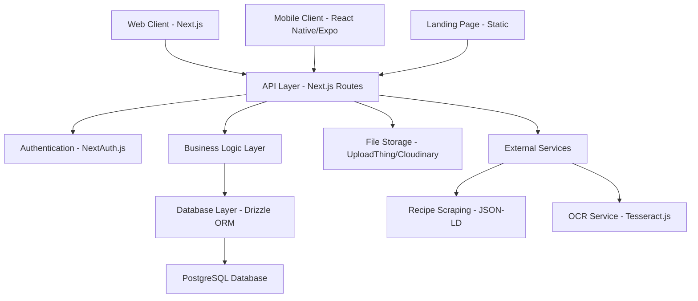

# Design Document

## Overview

Jump to Recipe is a full-stack web and mobile application built with Next.js, featuring a modern architecture that supports recipe management, cookbook creation, and collaborative sharing. The system uses a PostgreSQL database with Drizzle ORM, NextAuth.js for authentication, and supports both web and mobile clients through a unified API layer.

## Architecture

### System Architecture



### Technology Stack

- **Frontend Framework**: Next.js 14+ with App Router
- **Styling**: Tailwind CSS with shadcn/ui components
- **Authentication**: NextAuth.js with JWT strategy
- **Database**: PostgreSQL with Drizzle ORM
- **File Storage**: UploadThing or Cloudinary
- **Mobile**: React Native with Expo
- **Deployment**: Vercel (frontend), Railway/Fly.io (backend)

## Components and Interfaces

### Core Components

#### 1. Authentication System
- **NextAuth Configuration**: Supports GitHub, Google OAuth providers
- **Session Management**: JWT-based with role-based access control
- **Middleware Protection**: Route-level authentication guards
- **User Roles**: admin, elevated, regular user

#### 2. Recipe Management System
- **Recipe Parser**: JSON-LD scraping for URL imports
- **OCR Integration**: Image-to-text conversion for recipe cards
- **Unit Conversion**: Metric/Imperial conversion utilities
- **Rich Text Editor**: For notes and instructions

#### 3. Cookbook System
- **Cookbook Builder**: Drag-and-drop recipe organization
- **Permission System**: Public/private sharing with role-based access
- **Collaboration**: Multi-user editing with conflict resolution

#### 4. Grocery List Generator
- **Ingredient Aggregation**: Smart combining of overlapping ingredients
- **Category Grouping**: Automatic categorization (dairy, produce, etc.)
- **Quantity Scaling**: Dynamic serving size adjustments

### API Interface Design

#### Authentication Endpoints
```typescript
// NextAuth.js handles these automatically
GET/POST /api/auth/signin
GET/POST /api/auth/signout
GET /api/auth/session
GET /api/auth/providers
```

#### Recipe Management
```typescript
GET /api/recipes - List recipes with pagination and filters
POST /api/recipes - Create new recipe
GET /api/recipes/[id] - Get specific recipe
PUT /api/recipes/[id] - Update recipe
DELETE /api/recipes/[id] - Delete recipe
POST /api/recipes/import - Import from URL or image
```

#### Cookbook Management
```typescript
GET /api/cookbooks - List user's cookbooks
POST /api/cookbooks - Create new cookbook
GET /api/cookbooks/[id] - Get cookbook with recipes
PUT /api/cookbooks/[id] - Update cookbook
DELETE /api/cookbooks/[id] - Delete cookbook
POST /api/cookbooks/[id]/share - Share cookbook
```

#### Grocery Lists
```typescript
POST /api/grocery-lists/generate - Generate from selected recipes
GET /api/grocery-lists - List user's grocery lists
PUT /api/grocery-lists/[id] - Update grocery list
```

## Data Models

### Database Schema

```sql
-- Users table
CREATE TABLE users (
  id UUID PRIMARY KEY DEFAULT gen_random_uuid(),
  name VARCHAR(255) NOT NULL,
  email VARCHAR(255) UNIQUE NOT NULL,
  image TEXT,
  role VARCHAR(50) DEFAULT 'user',
  created_at TIMESTAMP DEFAULT NOW(),
  updated_at TIMESTAMP DEFAULT NOW()
);

-- Recipes table
CREATE TABLE recipes (
  id UUID PRIMARY KEY DEFAULT gen_random_uuid(),
  title VARCHAR(500) NOT NULL,
  description TEXT,
  ingredients JSONB NOT NULL,
  instructions JSONB NOT NULL,
  prep_time INTEGER,
  cook_time INTEGER,
  servings INTEGER,
  difficulty VARCHAR(50),
  tags TEXT[],
  notes TEXT,
  image_url TEXT,
  source_url TEXT,
  author_id UUID REFERENCES users(id),
  visibility VARCHAR(50) DEFAULT 'private',
  created_at TIMESTAMP DEFAULT NOW(),
  updated_at TIMESTAMP DEFAULT NOW()
);

-- Cookbooks table
CREATE TABLE cookbooks (
  id UUID PRIMARY KEY DEFAULT gen_random_uuid(),
  title VARCHAR(500) NOT NULL,
  description TEXT,
  cover_image_url TEXT,
  owner_id UUID REFERENCES users(id),
  is_public BOOLEAN DEFAULT false,
  created_at TIMESTAMP DEFAULT NOW(),
  updated_at TIMESTAMP DEFAULT NOW()
);

-- Cookbook recipes junction table
CREATE TABLE cookbook_recipes (
  id UUID PRIMARY KEY DEFAULT gen_random_uuid(),
  cookbook_id UUID REFERENCES cookbooks(id) ON DELETE CASCADE,
  recipe_id UUID REFERENCES recipes(id) ON DELETE CASCADE,
  position INTEGER NOT NULL,
  added_at TIMESTAMP DEFAULT NOW(),
  UNIQUE(cookbook_id, recipe_id)
);

-- Cookbook collaborators
CREATE TABLE cookbook_collaborators (
  id UUID PRIMARY KEY DEFAULT gen_random_uuid(),
  cookbook_id UUID REFERENCES cookbooks(id) ON DELETE CASCADE,
  user_id UUID REFERENCES users(id) ON DELETE CASCADE,
  permission VARCHAR(50) DEFAULT 'view', -- 'view', 'edit'
  invited_at TIMESTAMP DEFAULT NOW(),
  UNIQUE(cookbook_id, user_id)
);

-- Comments table
CREATE TABLE comments (
  id UUID PRIMARY KEY DEFAULT gen_random_uuid(),
  recipe_id UUID REFERENCES recipes(id) ON DELETE CASCADE,
  user_id UUID REFERENCES users(id) ON DELETE CASCADE,
  content TEXT NOT NULL,
  created_at TIMESTAMP DEFAULT NOW(),
  updated_at TIMESTAMP DEFAULT NOW()
);

-- Grocery lists table
CREATE TABLE grocery_lists (
  id UUID PRIMARY KEY DEFAULT gen_random_uuid(),
  user_id UUID REFERENCES users(id) ON DELETE CASCADE,
  title VARCHAR(500) NOT NULL,
  items JSONB NOT NULL,
  generated_from UUID[], -- Array of recipe IDs
  created_at TIMESTAMP DEFAULT NOW(),
  updated_at TIMESTAMP DEFAULT NOW()
);
```

### TypeScript Interfaces

```typescript
interface User {
  id: string;
  name: string;
  email: string;
  image?: string;
  role: 'admin' | 'elevated' | 'user';
  createdAt: Date;
  updatedAt: Date;
}

interface Recipe {
  id: string;
  title: string;
  description?: string;
  ingredients: Ingredient[];
  instructions: Instruction[];
  prepTime?: number;
  cookTime?: number;
  servings?: number;
  difficulty?: 'easy' | 'medium' | 'hard';
  tags: string[];
  notes?: string;
  imageUrl?: string;
  sourceUrl?: string;
  authorId: string;
  visibility: 'public' | 'private';
  createdAt: Date;
  updatedAt: Date;
}

interface Ingredient {
  id: string;
  name: string;
  amount: number;
  unit: string;
  category?: string;
}

interface Instruction {
  id: string;
  step: number;
  content: string;
  duration?: number;
}

interface Cookbook {
  id: string;
  title: string;
  description?: string;
  coverImageUrl?: string;
  ownerId: string;
  isPublic: boolean;
  recipes: Recipe[];
  collaborators: CookbookCollaborator[];
  createdAt: Date;
  updatedAt: Date;
}
```

## Error Handling

### API Error Responses
```typescript
interface APIError {
  error: string;
  message: string;
  statusCode: number;
  details?: any;
}

// Standard error responses
400 - Bad Request (validation errors)
401 - Unauthorized (authentication required)
403 - Forbidden (insufficient permissions)
404 - Not Found (resource doesn't exist)
409 - Conflict (duplicate resource)
500 - Internal Server Error
```

### Client-Side Error Handling
- Toast notifications for user-facing errors
- Retry mechanisms for network failures
- Graceful degradation for offline scenarios
- Form validation with real-time feedback

### Server-Side Error Handling
- Centralized error middleware
- Structured logging with context
- Database transaction rollbacks
- Rate limiting protection

## Testing Strategy

### Unit Testing
- **API Routes**: Jest testing for all endpoints
- **Database Operations**: Drizzle ORM query testing
- **Utility Functions**: Unit conversion, parsing logic
- **Authentication**: NextAuth configuration testing

### Integration Testing
- **Recipe Import Flow**: URL scraping and parsing
- **Cookbook Sharing**: Permission and collaboration logic
- **Grocery List Generation**: Ingredient aggregation
- **File Upload**: Image handling and storage

### End-to-End Testing
- **User Journeys**: Registration to recipe creation
- **Cross-Platform**: Web and mobile synchronization
- **Performance**: Load testing for concurrent users
- **Security**: Authentication and authorization flows

### Testing Tools
- **Unit/Integration**: Jest, React Testing Library
- **E2E**: Playwright or Cypress
- **API Testing**: Supertest
- **Database**: Test database with migrations

## Security Considerations

### Authentication Security
- JWT token expiration and refresh
- CSRF protection via NextAuth
- Secure cookie configuration
- OAuth provider validation

### Data Protection
- Input validation and sanitization
- SQL injection prevention via ORM
- XSS protection in rich text content
- File upload validation and scanning

### Privacy Controls
- Recipe visibility settings
- Cookbook sharing permissions
- User data export/deletion
- GDPR compliance considerations

## Performance Optimization

### Frontend Performance
- Next.js App Router with RSC
- Image optimization and lazy loading
- Code splitting and dynamic imports
- Caching strategies for static content

### Backend Performance
- Database indexing on frequently queried fields
- Connection pooling for PostgreSQL
- API response caching
- Pagination for large datasets

### Mobile Performance
- Offline-first architecture with sync
- Image compression and caching
- Lazy loading of recipe content
- Background sync for data updates