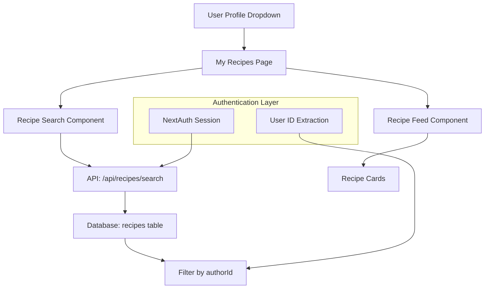

# Design Document

## Overview

The "My Recipes" feature extends the existing recipe management system by providing users with a dedicated view of their own created recipes. This feature leverages the existing recipe infrastructure while adding user-specific filtering and navigation enhancements. The implementation follows established patterns from the current recipes page and integrates seamlessly with the existing authentication and UI systems.

## Architecture

### High-Level Architecture



### Component Hierarchy

```
MyRecipesPage
├── PageHeader (title + description)
├── RecipeSearch (reused component)
├── EmptyState (conditional)
└── RecipeGrid
    └── RecipeCard[] (reused component)
```

## Components and Interfaces

### 1. My Recipes Page Component

**Location:** `src/app/my-recipes/page.tsx`

**Props:** None (uses session for user context)

**Key Features:**
- Reuses existing `RecipeSearch` component with user-specific filtering
- Implements same pagination/infinite scroll as main recipes page
- Shows empty state when no recipes exist
- Maintains search state and URL parameters

### 2. Updated User Profile Dropdown

**Location:** `src/components/user-profile-button.tsx`

**Changes:**
- Add "My Recipes" menu item between "Your Profile" and "Settings"
- Link to `/my-recipes` route

### 3. API Endpoint Enhancement

**Location:** `src/app/api/recipes/search/route.ts`

**Enhancement:**
- Leverage existing search endpoint with `authorId` parameter
- No new endpoint needed - existing search API already supports author filtering

### 4. Empty State Component

**Location:** `src/components/recipes/empty-state.tsx` (new)

**Props:**
```typescript
interface EmptyStateProps {
  title: string;
  description: string;
  actionLabel: string;
  actionHref: string;
  icon?: React.ReactNode;
}
```

## Data Models

### Existing Recipe Model (No Changes)

The existing recipe schema already supports the required functionality:

```typescript
interface Recipe {
  id: string;
  title: string;
  description: string;
  authorId: string; // Used for filtering user recipes
  visibility: 'public' | 'private';
  // ... other existing fields
}
```

### API Response Model

```typescript
interface MyRecipesResponse {
  recipes: Recipe[];
  pagination: {
    total: number;
    page: number;
    limit: number;
    totalPages: number;
    hasNextPage: boolean;
    hasPrevPage: boolean;
  };
  searchInfo: {
    query: string;
    hasQuery: boolean;
    sortBy: string;
    appliedFilters: FilterState;
  };
}
```

## Error Handling

### Authentication Errors
- **Unauthenticated Access:** Redirect to `/auth/login` with return URL
- **Session Expiry:** Show login prompt with session refresh option

### API Errors
- **Network Failures:** Show retry button with error message
- **Server Errors:** Display user-friendly error with support contact

### Empty States
- **No Recipes:** Show encouraging message with "Create Recipe" CTA
- **No Search Results:** Show "No recipes found" with clear search option

### Loading States
- **Initial Load:** Skeleton cards matching main recipes page
- **Search/Filter:** Loading spinner on search bar
- **Pagination:** Loading indicator on "Load More" button

## Testing Strategy

### Unit Tests

1. **My Recipes Page Component**
   - Renders correctly with recipes
   - Shows empty state when no recipes
   - Handles loading and error states
   - Maintains search parameters in URL

2. **Empty State Component**
   - Renders with correct props
   - Navigation links work correctly
   - Responsive design functions

3. **User Profile Dropdown**
   - Shows "My Recipes" option for authenticated users
   - Hides option for unauthenticated users
   - Navigation works correctly

### Integration Tests

1. **API Integration**
   - Search endpoint filters by current user
   - Pagination works correctly
   - Authentication is enforced

2. **Navigation Flow**
   - User can access My Recipes from profile dropdown
   - Unauthenticated users are redirected to login
   - Return URL works after authentication

### E2E Tests

1. **Complete User Journey**
   - Login → Navigate to My Recipes → View recipes
   - Create recipe → Verify it appears in My Recipes
   - Search within My Recipes → Verify results

2. **Responsive Design**
   - Test on mobile, tablet, and desktop
   - Verify touch interactions work
   - Check accessibility compliance

## Implementation Details

### Route Structure
```
/my-recipes
├── page.tsx (main page component)
└── loading.tsx (loading UI)
```

### URL Parameters
The page will support the same URL parameters as the main recipes page:
- `?query=search-term`
- `?sortBy=newest|oldest|popular|title`
- `?page=1`
- `?tags=["tag1","tag2"]`

### Performance Considerations

1. **Caching Strategy**
   - Client-side caching of recipe data
   - Optimistic updates for user actions
   - Stale-while-revalidate for recipe lists

2. **Pagination**
   - Default limit of 12 recipes per page
   - Infinite scroll for mobile
   - Traditional pagination for desktop

3. **Search Optimization**
   - Debounced search input (300ms)
   - Cancel previous requests on new search
   - Cache search results for session

### Accessibility

1. **Keyboard Navigation**
   - Tab order: Search → Sort → Filters → Recipe cards
   - Enter/Space activation for interactive elements
   - Focus management for modal interactions

2. **Screen Reader Support**
   - Proper ARIA labels for search and filter controls
   - Live regions for search results updates
   - Descriptive alt text for recipe images

3. **Visual Design**
   - High contrast mode support
   - Scalable text (up to 200%)
   - Clear focus indicators

### Security Considerations

1. **Authorization**
   - Server-side session validation
   - User can only see their own recipes
   - Proper error handling for unauthorized access

2. **Data Validation**
   - Input sanitization for search queries
   - Rate limiting on search API
   - CSRF protection on state-changing operations