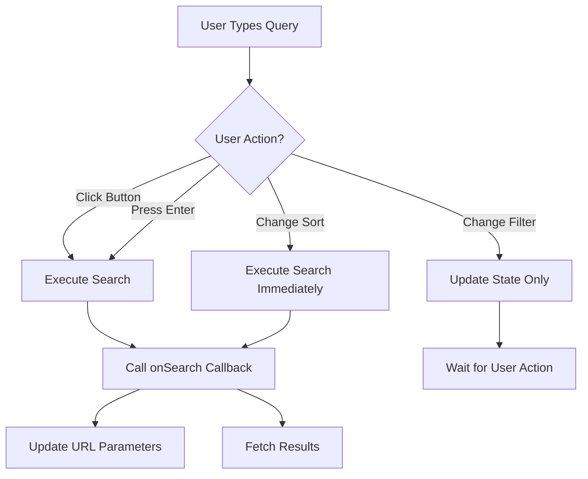

# Search Button Enhancement - Design Document

## Overview

This design enhances the recipe search interface by replacing automatic debounced search with explicit user-triggered search via a button or Enter key press. The enhancement applies to both the Recipes page (`RecipesClient.tsx`) and My Recipes page (`page.tsx`), which both use the shared `RecipeSearch` component.

The current implementation uses a 650ms debounce on the search query input, triggering automatic searches as users type. This will be replaced with manual search execution, giving users explicit control over when API calls are made while maintaining all existing functionality for filters, sorting, and URL parameter handling.

## Architecture

### Component Hierarchy

```
RecipesClient / MyRecipesPage
└── RecipeSearch (modified)
    ├── Search Input (existing)
    ├── Search Button (new)
    └── Filters Button (existing)
```

### State Management Approach

The search execution state will be managed within the `RecipeSearch` component using React's `useState` hook. The component will track:

1. **Input State**: Current values of search query and filters (existing)
2. **Execution State**: Whether a search is currently being executed (new)
3. **Last Executed State**: The last search parameters that were actually executed (new)

This approach ensures:
- Search only triggers on explicit user action (button click or Enter key)
- Loading states are properly managed during search execution
- URL parameters are updated only when search is executed
- The button can be disabled when no changes have been made since last search

### Search Execution Flow



## Components and Interfaces

### Modified RecipeSearch Component

**File**: `src/components/recipes/recipe-search.tsx`

**Key Changes**:
1. Remove `useDebounce` hook usage
2. Add search button next to input field
3. Add `isSearching` state to track execution
4. Add `lastExecutedParams` state to track what was last searched
5. Modify search execution to only trigger on button click or Enter key
6. Keep sort dropdown immediate execution (no button required)
7. Add keyboard handler for Enter key in search input

**New State Variables**:
```typescript
const [isSearching, setIsSearching] = useState(false);
const [lastExecutedParams, setLastExecutedParams] = useState<string>('');
```

**Search Button Specifications**:
- Position: Immediately after search input, before filters button
- Icon: Search icon (magnifying glass) from Lucide React
- Minimum touch target: 44x44px (WCAG 2.1 Level AAA)
- States:
  - Default: Enabled with primary styling
  - Disabled: When search input is empty AND no filters are applied
  - Loading: Shows spinner when `isSearching` is true
  - Hover: Visual feedback on hover
  - Focus: Keyboard focus ring

**Button Layout**:
```typescript
<Button
  onClick={handleSearchClick}
  disabled={isButtonDisabled}
  className="min-h-[44px] min-w-[44px]"
  aria-label="Search recipes"
>
  {isSearching ? (
    <Loader2 className="h-4 w-4 animate-spin" />
  ) : (
    <Search className="h-4 w-4" />
  )}
  <span className="ml-2 hidden sm:inline">Search</span>
</Button>
```

### Interface Updates

**No changes required** to the `SearchParams` interface - it remains the same:

```typescript
export interface SearchParams {
  query?: string;
  tags?: string[];
  difficulty?: 'easy' | 'medium' | 'hard';
  maxCookTime?: number;
  minCookTime?: number;
  maxPrepTime?: number;
  minPrepTime?: number;
  sortBy?: 'newest' | 'oldest' | 'popular' | 'title' | 'cookTime' | 'prepTime';
  page?: number;
}
```

**No changes required** to the `RecipeSearchProps` interface:

```typescript
interface RecipeSearchProps {
  onSearch: (params: SearchParams) => void;
  isLoading?: boolean;
  disabled?: boolean;
}
```

### Parent Component Integration

**RecipesClient.tsx** and **MyRecipesPage.tsx** require no changes. They will continue to:
- Pass `onSearch` callback to `RecipeSearch`
- Pass `isLoading` prop to show loading state
- Handle search results and pagination
- Parse URL parameters on initial load

## Data Models

No new data models are required. The existing `SearchParams` interface adequately represents all search parameters.

## UI/UX Specifications

### Visual Design Philosophy

Following the premium design philosophy outlined in the steering rules, the search button enhancement prioritizes:

1. **Clarity**: The button's purpose is immediately obvious through iconography and labeling
2. **Hierarchy**: The search button is visually prominent but doesn't compete with the primary "Create Recipe" action
3. **Consistency**: Button styling matches the existing design system (shadcn/ui Button component)
4. **Feedback**: Clear visual states communicate system status to users
5. **Accessibility**: Meets WCAG 2.1 Level AAA standards for touch targets and keyboard navigation

### Layout Specifications

**Desktop (≥640px)**:
```
[Search Input with Icon          ] [Search Button] [Filters Button]
```

**Mobile (<640px)**:
```
[Search Input with Icon          ]
[Search Button (Full Width)      ]
[Filters Button (Full Width)     ]
```

### Spacing and Alignment

- Gap between search input and button: 8px (Tailwind `gap-2`)
- Button padding: Follows shadcn/ui Button default sizing
- Minimum touch target: 44x44px enforced via `min-h-[44px] min-w-[44px]`
- All elements aligned on the same baseline

### Visual States

**Search Button States**:

1. **Default State**:
   - Background: Primary color
   - Text: Primary foreground color
   - Icon: Search (magnifying glass)
   - Cursor: Pointer

2. **Hover State**:
   - Background: Primary color with hover effect (slightly darker)
   - Smooth transition (150ms)

3. **Focus State**:
   - Visible focus ring (2px, ring color from design system)
   - Meets WCAG 2.1 focus indicator requirements

4. **Disabled State**:
   - Background: Muted
   - Text: Muted foreground
   - Cursor: Not-allowed
   - Opacity: Reduced

5. **Loading State**:
   - Icon: Spinner (Loader2) with spin animation
   - Button remains disabled during loading
   - Text changes to "Searching..." on desktop

### Typography

- Button text: Default button font (Geist Sans)
- Button text size: Default button size (sm on mobile, base on desktop)
- Icon size: 16px (h-4 w-4)

### Color Palette

All colors reference the design system tokens:
- Primary: `bg-primary`, `text-primary-foreground`
- Muted: `bg-muted`, `text-muted-foreground`
- Focus ring: `ring-ring`
- Hover: `hover:bg-primary/90`

### Responsive Behavior

**Mobile (320px - 639px)**:
- Search input: Full width
- Search button: Full width with icon and text
- Filters button: Full width
- Stack vertically with 8px gap

**Tablet (640px - 1023px)**:
- Search input: Flex-grow to fill available space
- Search button: Auto width with icon and text
- Filters button: Auto width
- Horizontal layout with 8px gap

**Desktop (≥1024px)**:
- Same as tablet but with more generous spacing
- Button text always visible

### Animation and Transitions

- Button hover: 150ms ease-in-out transition
- Loading spinner: Continuous rotation animation
- Focus ring: Instant appearance (no transition)
- State changes: Smooth 150ms transitions

## Accessibility Implementation

### Keyboard Navigation

**Tab Order**:
1. Search input field
2. Search button
3. Filters button
4. (When filters open) Filter controls

**Keyboard Shortcuts**:
- **Enter** in search input: Triggers search (same as clicking button)
- **Space** or **Enter** on search button: Triggers search
- **Tab**: Moves focus to next interactive element
- **Shift+Tab**: Moves focus to previous interactive element

### Screen Reader Support

**Search Button**:
```typescript
<Button
  aria-label="Search recipes"
  aria-describedby="search-button-help"
>
  {/* Button content */}
</Button>
<span id="search-button-help" className="sr-only">
  Press to search recipes with current filters
</span>
```

**Loading State Announcement**:
```typescript
<div role="status" aria-live="polite" className="sr-only">
  {isSearching ? "Searching recipes..." : ""}
</div>
```

**Button State Communication**:
- Disabled state: `aria-disabled="true"` automatically applied by Button component
- Loading state: Announced via live region
- Button purpose: Clear via `aria-label`

### WCAG 2.1 Compliance

**Level AAA Requirements Met**:
- Touch target size: Minimum 44x44px (2.5.5 Target Size)
- Focus indicators: Visible 2px focus ring (2.4.7 Focus Visible)
- Color contrast: Meets 7:1 ratio for normal text (1.4.6 Contrast Enhanced)
- Keyboard accessible: All functionality available via keyboard (2.1.1 Keyboard)

**Additional Accessibility Features**:
- Semantic HTML: Uses `<button>` element
- Focus management: Logical tab order maintained
- Error prevention: Button disabled when no search criteria
- Status updates: Live regions announce state changes

### Mobile Accessibility

- Touch target: 44x44px minimum (exceeds iOS and Android guidelines)
- Spacing: Adequate spacing between interactive elements (minimum 8px)
- Text size: Readable at default zoom levels
- Contrast: High contrast in both light and dark modes

## Mobile Responsiveness Strategy

### Breakpoint Strategy

Using Tailwind's default breakpoints:
- **xs** (default): 320px - 639px
- **sm**: 640px - 767px
- **md**: 768px - 1023px
- **lg**: 1024px+

### Layout Adaptations

**Extra Small Screens (320px - 639px)**:
```typescript
<div className="flex flex-col gap-2">
  <div className="relative w-full">
    <Input /> {/* Search input */}
  </div>
  <Button className="w-full min-h-[44px]">
    <Search className="h-4 w-4" />
    <span className="ml-2">Search</span>
  </Button>
  <Button className="w-full" variant="outline">
    <Filter className="h-4 w-4" />
    <span className="ml-2">Filters</span>
  </Button>
</div>
```

**Small Screens and Above (640px+)**:
```typescript
<div className="flex flex-row gap-2">
  <div className="relative flex-1">
    <Input /> {/* Search input */}
  </div>
  <Button className="min-h-[44px] min-w-[44px]">
    <Search className="h-4 w-4" />
    <span className="ml-2 hidden sm:inline">Search</span>
  </Button>
  <Button variant="outline">
    <Filter className="h-4 w-4" />
    <span className="ml-2">Filters</span>
  </Button>
</div>
```

### Touch Optimization

- All interactive elements meet 44x44px minimum
- Adequate spacing prevents accidental taps
- Button labels visible on mobile for clarity
- No hover-dependent functionality

### Performance Considerations

- No layout shifts during responsive transitions
- Smooth transitions between breakpoints
- Minimal re-renders on resize
- Efficient event handlers

## Error Handling

### Search Execution Errors

**Scenario**: API call fails during search execution

**Handling**:
1. `isSearching` state set to `false`
2. Error passed to parent component via existing error handling
3. Button returns to enabled state
4. User can retry search

**Implementation**: No changes needed - parent components already handle errors from `onSearch` callback.

### Invalid Search Parameters

**Scenario**: User enters invalid time ranges (e.g., min > max)

**Handling**:
1. Validation occurs in parent component (existing behavior)
2. Search button remains enabled
3. Error message displayed by parent component
4. User can correct and retry

**Implementation**: No changes needed - existing validation remains in place.

### Network Timeout

**Scenario**: Search request times out

**Handling**:
1. Handled by parent component's fetch logic
2. `isSearching` state reset when parent's `isLoading` becomes false
3. Error displayed to user
4. Retry available via search button

**Implementation**: No changes needed - existing timeout handling remains.

### Empty Search State

**Scenario**: User clicks search with empty input and no filters

**Handling**:
1. Button is disabled (preventive measure)
2. If somehow triggered, search executes with empty parameters
3. Returns all recipes (existing behavior)

**Implementation**: Button disabled state prevents this scenario.

## Correctness Properties

*A property is a characteristic or behavior that should hold true across all valid executions of a system—essentially, a formal statement about what the system should do. Properties serve as the bridge between human-readable specifications and machine-verifiable correctness guarantees.*

### Property 1: Manual Search Execution Only

*For any* search query and filter combination, search execution should occur ONLY when the user explicitly clicks the search button OR presses Enter in the search input field, and NOT automatically after a debounce delay.

**Validates: Requirements 2.1, 2.2**

### Property 2: Complete Parameter Inclusion

*For any* combination of search parameters (query, tags, difficulty, time filters, sort), when the search button is pressed, all non-empty parameters should be included in the search execution callback.

**Validates: Requirements 2.3**

### Property 3: URL Synchronization

*For any* search execution, the URL parameters should be updated to reflect all active search parameters, enabling bookmarking and sharing of search results.

**Validates: Requirements 2.4**

### Property 4: Responsive Layout Consistency

*For any* viewport width (from 320px to desktop), the search button should maintain its position relative to the search input and filters button according to the responsive layout specifications.

**Validates: Requirements 1.4, 3.3**

### Property 5: Loading State Display

*For any* search execution, while the search is in progress (isLoading is true), the button should display a loading spinner and be disabled to prevent duplicate submissions.

**Validates: Requirements 4.1**

### Property 6: Disabled State Logic

*For any* component state where the search input is empty AND no filters are applied (tags, difficulty, time ranges), the search button should be disabled.

**Validates: Requirements 4.2**

### Property 7: Enter Key Equivalence

*For any* search query, pressing Enter in the search input field should trigger the same search execution as clicking the search button with identical parameters.

**Validates: Requirements 5.1**

### Property 8: URL Parameter Restoration

*For any* valid set of URL parameters present on page load, the search state should be correctly initialized and the initial search should execute with those parameters.

**Validates: Requirements 6.1**

### Property 9: Sort Immediate Execution

*For any* sort option selection from the dropdown, the search should execute immediately without requiring the search button to be clicked.

**Validates: Requirements 6.2**

### Property 10: Filter State Preservation

*For any* filter configuration (tags, difficulty, time ranges), when the user modifies filters without clicking search, the filter state should be preserved until search is explicitly triggered.

**Validates: Requirements 6.3**

### Property 11: Clear Filters Reset

*For any* active filter state, clicking the "Clear All Filters" button should reset all filters to their default empty state and the search button should become disabled if the query is also empty.

**Validates: Requirements 6.4**


## Testing Strategy

### Dual Testing Approach

This feature requires both unit tests and property-based tests to ensure comprehensive coverage:

- **Unit tests**: Verify specific examples, edge cases, UI rendering, and accessibility features
- **Property tests**: Verify universal properties across all input combinations and state transitions

Both testing approaches are complementary and necessary. Unit tests catch concrete bugs in specific scenarios, while property tests verify general correctness across a wide range of inputs.

### Property-Based Testing

**Library**: fast-check (for TypeScript/JavaScript)

**Configuration**:
- Minimum 100 iterations per property test
- Each test tagged with feature name and property number
- Tag format: `Feature: search-button-enhancement, Property {N}: {property description}`

**Property Test Coverage**:

1. **Property 1 - Manual Search Execution**: Generate random search queries and filter combinations, simulate typing without clicking/pressing Enter, verify no search callback is invoked, then verify search IS invoked on button click or Enter press.

2. **Property 2 - Complete Parameter Inclusion**: Generate random combinations of all search parameters, trigger search, verify all non-empty parameters are passed to the onSearch callback.

3. **Property 3 - URL Synchronization**: Generate random search parameters, execute search, verify URL contains all active parameters in correct format.

4. **Property 4 - Responsive Layout Consistency**: Generate random viewport widths from 320px to 1920px, render component, verify button position and layout match specifications for the viewport range.

5. **Property 5 - Loading State Display**: Generate random search parameters, trigger search with mocked loading state, verify button shows spinner and is disabled.

6. **Property 6 - Disabled State Logic**: Generate random component states with various combinations of empty/non-empty query and filters, verify button disabled state matches expected logic.

7. **Property 7 - Enter Key Equivalence**: Generate random search queries, trigger search via Enter key and via button click separately, verify identical parameters passed to callback in both cases.

8. **Property 8 - URL Parameter Restoration**: Generate random valid URL parameter combinations, mount component with those parameters, verify search state is correctly initialized.

9. **Property 9 - Sort Immediate Execution**: Generate random sort options, change sort dropdown, verify search executes immediately without button click.

10. **Property 10 - Filter State Preservation**: Generate random filter configurations, modify filters without triggering search, verify filter state is preserved in component state.

11. **Property 11 - Clear Filters Reset**: Generate random active filter states, trigger clear filters, verify all filters reset and button disabled state updates correctly.

### Unit Testing

**Test Framework**: Jest with React Testing Library

**Unit Test Coverage**:

**Component Rendering**:
- Search button renders with correct icon (magnifying glass)
- Search button has proper aria-label
- Button has minimum 44x44px touch target size
- Button text visible on desktop, hidden on mobile (responsive)

**User Interactions**:
- Clicking search button triggers onSearch callback
- Pressing Enter in search input triggers onSearch callback
- Typing in search input does NOT trigger search automatically
- Clicking filters button toggles filter panel

**Button States**:
- Button disabled when query empty and no filters
- Button enabled when query has text
- Button enabled when filters are applied
- Button shows loading spinner when isLoading prop is true
- Button disabled during loading state

**Keyboard Navigation**:
- Tab order: search input → search button → filters button
- Button focusable via Tab key
- Button activatable via Space key
- Button activatable via Enter key
- Focus ring visible on keyboard focus

**Accessibility**:
- Button has role="button"
- Button has accessible name via aria-label
- Loading state announced to screen readers
- Button disabled state communicated to assistive technology

**Responsive Behavior**:
- Layout stacks vertically on mobile (<640px)
- Layout horizontal on tablet and desktop (≥640px)
- Button text hidden on mobile, visible on desktop
- Touch target size maintained across all viewports

**Edge Cases**:
- Empty search with no filters (button disabled)
- Search with only whitespace (treated as empty)
- Rapid button clicks (prevented by disabled state during loading)
- Enter key while button is disabled (no search triggered)

**Backward Compatibility**:
- URL parameters parsed correctly on mount
- Sort dropdown triggers immediate search
- Advanced filters work as before
- Clear filters resets all state

### Integration Testing

**Scenarios to Test**:

1. **Complete Search Flow**: User types query, adds filters, clicks search button, results load, URL updates
2. **Enter Key Flow**: User types query, presses Enter, results load
3. **Sort Change Flow**: User changes sort dropdown, search executes immediately
4. **Filter Modification Flow**: User opens filters, adds tags, closes filters, clicks search
5. **Clear Filters Flow**: User has active filters, clicks clear, all filters reset, button disabled
6. **URL Restoration Flow**: User loads page with URL parameters, search executes with those parameters
7. **Error Recovery Flow**: Search fails, user modifies query, clicks search again

### Accessibility Testing

**Manual Testing Checklist**:
- [ ] Keyboard-only navigation works for all interactions
- [ ] Screen reader announces button purpose and state changes
- [ ] Focus indicators visible and meet WCAG 2.1 standards
- [ ] Touch targets meet 44x44px minimum on mobile devices
- [ ] Color contrast meets WCAG 2.1 Level AAA (7:1 ratio)
- [ ] Zoom to 200% maintains usability

**Automated Accessibility Testing**:
- Run jest-axe on rendered component
- Verify no accessibility violations
- Test with multiple viewport sizes

### Performance Testing

**Metrics to Monitor**:
- Component render time (should be <16ms)
- Search execution time (depends on API, not component)
- No unnecessary re-renders when typing (search not triggered)
- Smooth transitions between button states

### Regression Testing

**Critical Paths to Verify**:
- Existing RecipesClient functionality unchanged
- Existing MyRecipesPage functionality unchanged
- URL parameter handling unchanged
- Filter functionality unchanged
- Sort functionality unchanged
- Pagination unchanged
- Error handling unchanged

## Implementation Phases

### Phase 1: Component Modification

**Scope**: Modify RecipeSearch component to add search button and remove debouncing

**Tasks**:
1. Remove useDebounce hook usage
2. Add search button UI element
3. Add isSearching state management
4. Add lastExecutedParams state tracking
5. Implement handleSearchClick function
6. Implement handleKeyDown for Enter key
7. Update search execution logic
8. Maintain sort dropdown immediate execution

**Deliverable**: Modified RecipeSearch component with search button

### Phase 2: Styling and Responsiveness

**Scope**: Implement responsive layout and visual states

**Tasks**:
1. Add responsive layout classes (mobile/desktop)
2. Implement button states (default, hover, focus, disabled, loading)
3. Ensure 44x44px minimum touch target
4. Add loading spinner animation
5. Test across all breakpoints

**Deliverable**: Fully styled and responsive search button

### Phase 3: Accessibility Implementation

**Scope**: Ensure WCAG 2.1 Level AAA compliance

**Tasks**:
1. Add aria-label to search button
2. Add screen reader announcements for loading state
3. Verify keyboard navigation and tab order
4. Test with screen readers
5. Verify focus indicators
6. Test touch target sizes on mobile devices

**Deliverable**: Accessible search button meeting WCAG 2.1 Level AAA

### Phase 4: Testing

**Scope**: Implement comprehensive test coverage

**Tasks**:
1. Write property-based tests for all 11 properties
2. Write unit tests for component rendering and interactions
3. Write integration tests for complete flows
4. Run accessibility tests with jest-axe
5. Perform manual accessibility testing
6. Test in both RecipesClient and MyRecipesPage contexts

**Deliverable**: Complete test suite with >90% coverage

### Phase 5: Integration and Verification

**Scope**: Verify integration with parent components and backward compatibility

**Tasks**:
1. Test in RecipesClient.tsx
2. Test in MyRecipesPage.tsx
3. Verify URL parameter handling
4. Verify sort dropdown behavior
5. Verify filter functionality
6. Verify pagination
7. Test error scenarios
8. Perform regression testing

**Deliverable**: Fully integrated and verified feature

## Notes

- No changes required to parent components (RecipesClient, MyRecipesPage)
- No changes required to API endpoints
- No changes required to TypeScript interfaces
- Backward compatible with existing URL parameter handling
- Maintains all existing accessibility features
- Follows existing design system (shadcn/ui)
