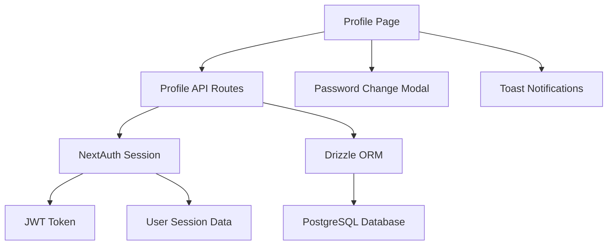

# Design Document

## Overview

The User Profile Page feature will provide a centralized interface for users to view and manage their account information. The design leverages the existing NextAuth.js authentication system, Drizzle ORM database schema, and shadcn/ui component library to create a consistent and intuitive user experience.

## Architecture

### High-Level Architecture



### Component Hierarchy

```
ProfilePage
├── ProfileLayout
│   ├── ProfileSidebar
│   │   ├── UserInfo
│   │   └── ActionButtons
│   └── ProfileForm
│       ├── EditableField (Name)
│       ├── EditableField (Email)
│       ├── ReadOnlyField (Role)
│       ├── ReadOnlyField (Last Updated)
│       └── SaveButton
├── PasswordChangeModal
│   ├── CurrentPasswordField
│   ├── NewPasswordField
│   └── ConfirmButton
└── ToastProvider
```

## Components and Interfaces

### Core Components

#### 1. ProfilePage Component
- **Location**: `src/app/profile/page.tsx`
- **Type**: Server Component
- **Responsibilities**:
  - Fetch user session and data
  - Render the main profile layout
  - Handle authentication redirects

#### 2. ProfileForm Component
- **Location**: `src/components/profile/profile-form.tsx`
- **Type**: Client Component
- **Responsibilities**:
  - Manage form state with React Hook Form
  - Handle inline editing for name and email
  - Submit profile updates to API
  - Display loading states and validation errors

#### 3. EditableField Component
- **Location**: `src/components/profile/editable-field.tsx`
- **Type**: Client Component
- **Responsibilities**:
  - Toggle between display and edit modes
  - Handle field-specific validation
  - Support different input types (text, email)

#### 4. PasswordChangeModal Component
- **Location**: `src/components/profile/password-change-modal.tsx`
- **Type**: Client Component
- **Responsibilities**:
  - Manage password change form
  - Validate current password
  - Submit password updates
  - Handle modal open/close state

### API Interfaces

#### 1. Profile API Routes

**GET /api/user/profile**
- Returns current user profile data
- Existing implementation supports this

**PATCH /api/user/profile**
- Updates user profile fields (name, email)
- New implementation needed to extend existing PUT route

**PATCH /api/user/password**
- Updates user password for credentials users
- New implementation needed

#### 2. Data Transfer Objects

```typescript
interface ProfileUpdateRequest {
  name?: string;
  email?: string;
}

interface PasswordChangeRequest {
  currentPassword: string;
  newPassword: string;
}

interface ProfileResponse {
  id: string;
  name: string;
  email: string;
  role: string;
  image?: string;
  updatedAt: string;
  authProvider: 'credentials' | 'google';
}
```

## Data Models

### User Schema Extensions

The existing user schema in `src/db/schema/users.ts` already supports all required fields:

```typescript
export const users = pgTable('users', {
  id: uuid('id').primaryKey(),
  name: varchar('name', { length: 255 }).notNull(),
  email: varchar('email', { length: 255 }).notNull().unique(),
  password: text('password'), // null for OAuth users
  image: text('image'),
  role: varchar('role', { length: 50 }).default('user').notNull(),
  createdAt: timestamp('created_at').defaultNow(),
  updatedAt: timestamp('updated_at').defaultNow(),
});
```

### Authentication Provider Detection

To determine if a user is Google-authenticated, we'll check:
1. If `user.password` is null
2. Query the `accounts` table for Google provider records

```typescript
const isGoogleUser = !user.password || await db.query.accounts.findFirst({
  where: and(
    eq(accounts.userId, user.id),
    eq(accounts.provider, 'google')
  )
});
```

## Error Handling

### Client-Side Error Handling

1. **Form Validation Errors**
   - Use Zod schema validation with React Hook Form
   - Display field-level errors inline
   - Prevent submission with invalid data

2. **Network Errors**
   - Retry logic for transient failures
   - Graceful degradation for offline scenarios
   - Clear error messages in toast notifications

3. **Authentication Errors**
   - Redirect to login page for unauthenticated users
   - Handle session expiration gracefully

### Server-Side Error Handling

1. **Input Validation**
   - Zod schema validation for all API inputs
   - Return 400 status with detailed error messages

2. **Database Errors**
   - Handle unique constraint violations (email conflicts)
   - Transaction rollback for data consistency
   - Return 500 status for unexpected errors

3. **Authentication Errors**
   - Return 401 for unauthenticated requests
   - Return 403 for insufficient permissions

## Testing Strategy

### Unit Tests

1. **Component Tests**
   - ProfileForm component behavior
   - EditableField toggle functionality
   - PasswordChangeModal form validation
   - Mock API responses and error states

2. **API Route Tests**
   - Profile update endpoint validation
   - Password change endpoint security
   - Authentication middleware behavior

3. **Utility Function Tests**
   - Form validation schemas
   - Authentication provider detection
   - Error handling utilities

### Integration Tests

1. **End-to-End User Flows**
   - Complete profile update workflow
   - Password change for credentials users
   - Google user restrictions (read-only email/password)

2. **API Integration Tests**
   - Database transaction integrity
   - Session management consistency
   - Error response formats

### Accessibility Tests

1. **Keyboard Navigation**
   - Tab order through form fields
   - Modal focus management
   - Screen reader compatibility

2. **ARIA Labels**
   - Form field descriptions
   - Error message associations
   - Loading state announcements

## Security Considerations

### Input Validation
- Server-side validation for all user inputs
- SQL injection prevention through Drizzle ORM
- XSS protection through proper escaping

### Password Security
- Bcrypt hashing for password storage
- Current password verification before updates
- Rate limiting for password change attempts

### Session Management
- JWT token validation for all API requests
- Session expiration handling
- Secure cookie configuration

### Data Privacy
- User can only access their own profile data
- Sensitive fields (password hash) never returned in API responses
- Audit logging for profile changes

## Performance Considerations

### Client-Side Optimization
- Debounced input validation
- Optimistic UI updates for better perceived performance
- Lazy loading of modal components

### Server-Side Optimization
- Database query optimization with proper indexes
- Response caching for read-only data
- Connection pooling for database access

### Bundle Size
- Code splitting for profile-specific components
- Tree shaking of unused utilities
- Optimized image loading for avatars

## Responsive Design

### Desktop Layout (≥768px)
- Two-column layout with sidebar and main content
- Fixed sidebar with user info and actions
- Spacious form layout with clear visual hierarchy

### Mobile Layout (<768px)
- Single-column stacked layout
- Collapsible user info section
- Touch-friendly form controls and buttons

### Tablet Layout (768px-1024px)
- Adaptive layout between desktop and mobile
- Optimized spacing for touch interactions
- Maintained visual hierarchy with adjusted proportions